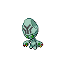
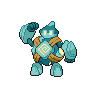
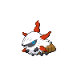
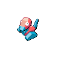

# Evolution Changes

## Level Changes

| Base Pokemon                                                                                  | Level | Evolved Pokemon                                                                                 |
| --------------------------------------------------------------------------------------------- | ----- | ----------------------------------------------------------------------------------------------- |
|  [Scraggy](/blaze-black-volt-white-two-wiki/pokemon/559)   | 35    |  [Scrafty](/blaze-black-volt-white-two-wiki/pokemon/560)     |
|  [Elgyem](/blaze-black-volt-white-two-wiki/pokemon/605)     | 34    |  [Beheeyem](/blaze-black-volt-white-two-wiki/pokemon/606)   |
|  [Litwick](/blaze-black-volt-white-two-wiki/pokemon/607)   | 34    |  [Lampent](/blaze-black-volt-white-two-wiki/pokemon/608)     |
|  [Mienfoo](/blaze-black-volt-white-two-wiki/pokemon/619)   | 42    |  [Mienshao](/blaze-black-volt-white-two-wiki/pokemon/620)   |
|  [Golett](/blaze-black-volt-white-two-wiki/pokemon/622)     | 38    |  [Golurk](/blaze-black-volt-white-two-wiki/pokemon/623)       |
|  [Pawniard](/blaze-black-volt-white-two-wiki/pokemon/624) | 37    |  [Bisharp](/blaze-black-volt-white-two-wiki/pokemon/625)     |
|  [Rufflet](/blaze-black-volt-white-two-wiki/pokemon/627)   | 36    |  [Braviary](/blaze-black-volt-white-two-wiki/pokemon/628)   |
|  [Vullaby](/blaze-black-volt-white-two-wiki/pokemon/629)   | 36    |  [Mandibuzz](/blaze-black-volt-white-two-wiki/pokemon/630) |
|  [Deino](/blaze-black-volt-white-two-wiki/pokemon/633)       | 42    |  [Zweilous](/blaze-black-volt-white-two-wiki/pokemon/634)   |
|  [Zweilous](/blaze-black-volt-white-two-wiki/pokemon/634) | 58    |  [Hydreigon](/blaze-black-volt-white-two-wiki/pokemon/635) |
|  [Larvesta](/blaze-black-volt-white-two-wiki/pokemon/636) | 44    |  [Volcarona](/blaze-black-volt-white-two-wiki/pokemon/637) |

## Item Interaction Changes

| Base Pokemon                                                                                      | Item                                                          | Evolved Pokemon                                                                                   |
| ------------------------------------------------------------------------------------------------- | ------------------------------------------------------------- | ------------------------------------------------------------------------------------------------- |
|  [Feebas](/blaze-black-volt-white-two-wiki/pokemon/349)         |   prism-scale    |  [Milotic](/blaze-black-volt-white-two-wiki/pokemon/350)       |
|  [Poliwhirl](/blaze-black-volt-white-two-wiki/pokemon/061)   |   kings-rock       |  [Politoed](/blaze-black-volt-white-two-wiki/pokemon/186)     |
|  [Kadabra](/blaze-black-volt-white-two-wiki/pokemon/064)       |   covenant-ore |  [Alakazam](/blaze-black-volt-white-two-wiki/pokemon/065)     |
|  [Machoke](/blaze-black-volt-white-two-wiki/pokemon/067)       |   covenant-ore |  [Machamp](/blaze-black-volt-white-two-wiki/pokemon/068)       |
|  [Graveler](/blaze-black-volt-white-two-wiki/pokemon/075)     |   covenant-ore |  [Golem](/blaze-black-volt-white-two-wiki/pokemon/076)           |
|  [Slowpoke](/blaze-black-volt-white-two-wiki/pokemon/079)     |   kings-rock       |  [Slowking](/blaze-black-volt-white-two-wiki/pokemon/199)     |
|  [Haunter](/blaze-black-volt-white-two-wiki/pokemon/093)       |   covenant-ore |  [Gengar](/blaze-black-volt-white-two-wiki/pokemon/094)         |
|  [Onix](/blaze-black-volt-white-two-wiki/pokemon/095)             |   metal-coat       |  [Steelix](/blaze-black-volt-white-two-wiki/pokemon/208)       |
|  [Rhydon](/blaze-black-volt-white-two-wiki/pokemon/112)         |   protector          |  [Rhyperior](/blaze-black-volt-white-two-wiki/pokemon/464)   |
|  [Seadra](/blaze-black-volt-white-two-wiki/pokemon/117)         |   dragon-scale |  [Kingdra](/blaze-black-volt-white-two-wiki/pokemon/230)       |
|  [Scyther](/blaze-black-volt-white-two-wiki/pokemon/123)       |   metal-coat       |  [Scizor](/blaze-black-volt-white-two-wiki/pokemon/212)         |
|  [Electabuzz](/blaze-black-volt-white-two-wiki/pokemon/125) |   electirizer    |  [Electivire](/blaze-black-volt-white-two-wiki/pokemon/466) |
|  [Magmar](/blaze-black-volt-white-two-wiki/pokemon/126)         |   magmarizer       |  [Magmortar](/blaze-black-volt-white-two-wiki/pokemon/467)   |
|  [Porygon](/blaze-black-volt-white-two-wiki/pokemon/137)       |   up-grade             |  [Porygon2](/blaze-black-volt-white-two-wiki/pokemon/233)     |
|  [Porygon2](/blaze-black-volt-white-two-wiki/pokemon/233)     |   dubious-disc |  [Porygon-z](/blaze-black-volt-white-two-wiki/pokemon/474)   |
|  [Dusclops](/blaze-black-volt-white-two-wiki/pokemon/356)     |   reaper-cloth |  [Dusknoir](/blaze-black-volt-white-two-wiki/pokemon/477)     |
|  [Boldore](/blaze-black-volt-white-two-wiki/pokemon/525)       |   covenant-ore |  [Gigalith](/blaze-black-volt-white-two-wiki/pokemon/526)     |
|  [Gurdurr](/blaze-black-volt-white-two-wiki/pokemon/533)       |   covenant-ore |  [Conkeldurr](/blaze-black-volt-white-two-wiki/pokemon/534) |

## Other Changes

| Base Pokemon                                                                                      | Method                            | Evolved Pokemon                                                                                   |
| ------------------------------------------------------------------------------------------------- | --------------------------------- | ------------------------------------------------------------------------------------------------- |
|  [Karrablast](/blaze-black-volt-white-two-wiki/pokemon/588) | Level up with a Shelmet in party  |  [Escavalier](/blaze-black-volt-white-two-wiki/pokemon/589) |
|  [Shelmet](/blaze-black-volt-white-two-wiki/pokemon/616)       | Level up with Karrablast in party |  [Accelgor](/blaze-black-volt-white-two-wiki/pokemon/617)     |