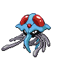

# 073 - Tentacruel

## Types

| Version | Type                                                                |
| :-----: | ------------------------------------------------------------------: |
| Classic |   |

## Defenses

| Immune x0 | Resistant ×¼ | Resistant ×½                                                                                                                                                                                                                                                                                      | Normal ×1                                                                                                                                                                                                                                                        | Weak ×2                                                                                                                | Weak ×4 |
| --------- | ------------ | ------------------------------------------------------------------------------------------------------------------------------------------------------------------------------------------------------------------------------------------------------------------------------------------------- | ---------------------------------------------------------------------------------------------------------------------------------------------------------------------------------------------------------------------------------------------------------------- | ---------------------------------------------------------------------------------------------------------------------- | ------- |
|           |              |         |        |    |         |

## Abilities

| Version | Ability                              |
| ------- | ------------------------------------ |
| All     | Clear-Body / Liquid-Ooze / Rain-Dish |

## Base Stats

| Version | HP | Atk | Def | SAtk | SDef | Spd | BST |
| ------- | -- | --- | --- | ---- | ---- | --- | --- |
| All     | 80 | 70  | 65  | 80   | 120  | 100 | 515 |

## Level Up Moves

| Level | Name         | Power | Accuracy | PP | Type                                 | Damage Class                           |
| ----- | ------------ | ----- | -------- | -- | ------------------------------------ | -------------------------------------- |
| 1     | Poison-Sting | 15    | 100%     | 35 |    |  |
| 1     | Supersonic   | -     | 55%      | 20 |    |      |
| 1     | Constrict    | 10    | 100%     | 35 |    |  |
| 12    | Acid         | 40    | 100%     | 30 |    |    |
| 15    | Toxic-Spikes | -     | -        | 20 |    |      |
| 19    | Bubble-Beam  | 65    | 100%     | 20 |      |    |
| 22    | Wrap         | 15    | 90%      | 20 |    |  |
| 26    | Acid-Spray   | 40    | 100%     | 20 |    |    |
| 29    | Barrier      | -     | -        | 20 |  |      |
| 34    | Water-Pulse  | 60    | 100%     | 20 |      |    |
| 38    | Poison-Jab   | 80    | 100%     | 20 |    |  |
| 43    | Screech      | -     | 85%      | 40 |    |      |
| 47    | Hex          | 65    | 100%     | 10 |      |    |
| 52    | Hydro-Pump   | 110   | 80%      | 5  |      |    |
| 56    | Sludge-Wave  | 95    | 100%     | 10 |    |    |
| 61    | Wring-Out    | -     | 100%     | 5  |    |    |

## Learnable Moves

| Machine | Name         | Power | Accuracy | PP | Type                                 | Damage Class                           |
| ------- | ------------ | ----- | -------- | -- | ------------------------------------ | -------------------------------------- |
| HM01    | Cut          | 60    | 100%     | 20 |      |  |
| HM03    | Surf         | 90    | 100%     | 15 |      |    |
| HM05    | Waterfall    | 80    | 100%     | 15 |      |  |
| HM06    | Dive         | 80    | 100%     | 10 |      |  |
| TM06    | Toxic        | -     | 90%      | 10 |    |      |
| TM07    | Hail         | -     | -        | 10 |          |      |
| TM09    | Venoshock    | 65    | 100%     | 10 |    |    |
| TM10    | Hidden-Power | 60    | 100%     | 15 |    |    |
| TM13    | Ice-Beam     | 90    | 100%     | 10 |          |    |
| TM14    | Blizzard     | 110   | 70%      | 5  |          |    |
| TM15    | Hyper-Beam   | 150   | 90%      | 5  |    |    |
| TM17    | Protect      | -     | -        | 10 |    |      |
| TM18    | Rain-Dance   | -     | -        | 5  |      |      |
| TM20    | Safeguard    | -     | -        | 25 |    |      |
| TM21    | Frustration  | -     | 100%     | 20 |    |  |
| TM27    | Return       | -     | 100%     | 20 |    |  |
| TM32    | Double-Team  | -     | -        | 15 |    |      |
| TM36    | Sludge-Bomb  | 90    | 100%     | 10 |    |    |
| TM42    | Facade       | 70    | 100%     | 20 |    |  |
| TM44    | Rest         | -     | -        | 10 |  |      |
| TM45    | Attract      | -     | 100%     | 15 |    |      |
| TM46    | Thief        | 60    | 100%     | 25 |        |  |
| TM48    | Round        | 60    | 100%     | 15 |    |    |
| TM55    | Scald        | 80    | 100%     | 15 |      |    |
| TM66    | Payback      | 50    | 100%     | 10 |        |  |
| TM68    | Giga-Impact  | 150   | 90%      | 5  |    |  |
| TM75    | Swords-Dance | -     | -        | 20 |    |      |
| TM87    | Swagger      | -     | 85%      | 15 |    |      |
| TM90    | Substitute   | -     | -        | 10 |    |      |