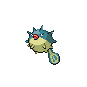

# 211 - Qwilfish

## Types

| Version | Type                                                                |
| :-----: | ------------------------------------------------------------------: |
| Classic |   |

## Defenses

| Immune x0 | Resistant ×¼ | Resistant ×½                                                                                                                                                                                                                                                                                      | Normal ×1                                                                                                                                                                                                                                                        | Weak ×2                                                                                                                | Weak ×4 |
| --------- | ------------ | ------------------------------------------------------------------------------------------------------------------------------------------------------------------------------------------------------------------------------------------------------------------------------------------------- | ---------------------------------------------------------------------------------------------------------------------------------------------------------------------------------------------------------------------------------------------------------------- | ---------------------------------------------------------------------------------------------------------------------- | ------- |
|           |              |         |        |    |         |

## Abilities

| Version | Ability                   |
| ------- | ------------------------- |
| All     | Poison-Point / Intimidate |

## Base Stats

| Version | HP | Atk | Def | SAtk | SDef | Spd | BST |
| ------- | -- | --- | --- | ---- | ---- | --- | --- |
| All     | 65 | 105 | 75  | 55   | 55   | 95  | 450 |

## Level Up Moves

| Level | Name         | Power | Accuracy | PP | Type                                   | Damage Class                           |
| ----- | ------------ | ----- | -------- | -- | -------------------------------------- | -------------------------------------- |
| 1     | Tackle       | 40    | 100%     | 35 |      |  |
| 1     | Poison-Sting | 15    | 100%     | 35 |      |  |
| 1     | Spikes       | -     | -        | 20 |      |      |
| 9     | Harden       | -     | -        | 30 |      |      |
| 9     | Minimize     | -     | -        | 10 |      |      |
| 13    | Water-Gun    | 40    | 100%     | 25 |        |    |
| 17    | Rollout      | 30    | 90%      | 20 |          |  |
| 21    | Toxic-Spikes | -     | -        | 20 |      |      |
| 25    | Stockpile    | -     | -        | 20 |      |      |
| 25    | Spit-Up      | -     | 100%     | 10 |      |    |
| 29    | Revenge      | 60    | 100%     | 10 |  |  |
| 33    | Brine        | 65    | 100%     | 10 |        |    |
| 37    | Pin-Missile  | 25    | 95%      | 20 |            |  |
| 41    | Take-Down    | 90    | 85%      | 20 |      |  |
| 45    | Aqua-Tail    | 90    | 90%      | 10 |        |  |
| 49    | Poison-Jab   | 80    | 100%     | 20 |      |  |
| 53    | Destiny-Bond | -     | -        | 5  |        |      |
| 57    | Hydro-Pump   | 110   | 80%      | 5  |        |    |

## Learnable Moves

| Machine | Name         | Power | Accuracy | PP | Type                                   | Damage Class                           |
| ------- | ------------ | ----- | -------- | -- | -------------------------------------- | -------------------------------------- |
| HM03    | Surf         | 90    | 100%     | 15 |        |    |
| HM05    | Waterfall    | 80    | 100%     | 15 |        |  |
| HM06    | Dive         | 80    | 100%     | 10 |        |  |
| TM06    | Toxic        | -     | 90%      | 10 |      |      |
| TM07    | Hail         | -     | -        | 10 |            |      |
| TM09    | Venoshock    | 65    | 100%     | 10 |      |    |
| TM10    | Hidden-Power | 60    | 100%     | 15 |      |    |
| TM12    | Taunt        | -     | 100%     | 20 |          |      |
| TM13    | Ice-Beam     | 90    | 100%     | 10 |            |    |
| TM14    | Blizzard     | 110   | 70%      | 5  |            |    |
| TM17    | Protect      | -     | -        | 10 |      |      |
| TM18    | Rain-Dance   | -     | -        | 5  |        |      |
| TM21    | Frustration  | -     | 100%     | 20 |      |  |
| TM27    | Return       | -     | 100%     | 20 |      |  |
| TM30    | Shadow-Ball  | 80    | 100%     | 15 |        |    |
| TM32    | Double-Team  | -     | -        | 15 |      |      |
| TM34    | Sludge-Wave  | 95    | 100%     | 10 |      |    |
| TM36    | Sludge-Bomb  | 90    | 100%     | 10 |      |    |
| TM42    | Facade       | 70    | 100%     | 20 |      |  |
| TM44    | Rest         | -     | -        | 10 |    |      |
| TM45    | Attract      | -     | 100%     | 15 |      |      |
| TM48    | Round        | 60    | 100%     | 15 |      |    |
| TM55    | Scald        | 80    | 100%     | 15 |        |    |
| TM64    | Explosion    | 250   | 100%     | 5  |      |  |
| TM66    | Payback      | 50    | 100%     | 10 |          |  |
| TM73    | Thunder-Wave | -     | 90%      | 20 |  |      |
| TM74    | Gyro-Ball    | -     | 100%     | 5  |        |  |
| TM87    | Swagger      | -     | 85%      | 15 |      |      |
| TM90    | Substitute   | -     | -        | 10 |      |      |