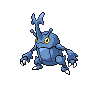

# 214 - Heracross

## Types

| Version | Type                                                                |
| :-----: | ------------------------------------------------------------------: |
| Classic |   |

## Defenses

| Immune x0 | Resistant ×¼ | Resistant ×½                                                                                                                                                                           | Normal ×1                                                                                                                                                                                                                                                                                                                                      | Weak ×2                                                                                                      | Weak ×4                            |
| --------- | ------------ | -------------------------------------------------------------------------------------------------------------------------------------------------------------------------------------- | ---------------------------------------------------------------------------------------------------------------------------------------------------------------------------------------------------------------------------------------------------------------------------------------------------------------------------------------------- | ------------------------------------------------------------------------------------------------------------ | ---------------------------------- |
|           |              |      |          |    |  |

## Abilities

| Version | Ability      |
| ------- | ------------ |
| All     | Moxie / Guts |

## Base Stats

| Version | HP | Atk | Def | SAtk | SDef | Spd | BST |
| ------- | -- | --- | --- | ---- | ---- | --- | --- |
| All     | 80 | 125 | 75  | 40   | 95   | 85  | 500 |

## Level Up Moves

| Level | Name         | Power | Accuracy | PP | Type                                   | Damage Class                           |
| ----- | ------------ | ----- | -------- | -- | -------------------------------------- | -------------------------------------- |
| 1     | Horn-Attack  | 65    | 100%     | 25 |      |  |
| 1     | Tackle       | 40    | 100%     | 35 |      |  |
| 1     | Leer         | -     | 100%     | 30 |      |      |
| 1     | Endure       | -     | -        | 10 |      |      |
| 1     | Night-Slash  | 70    | 100%     | 15 |          |  |
| 7     | Fury-Attack  | 15    | 85%      | 20 |      |  |
| 13    | Aerial-Ace   | 60    | -        | 20 |      |  |
| 19    | Brick-Break  | 75    | 100%     | 15 |  |  |
| 25    | Counter      | -     | 100%     | 20 |  |  |
| 31    | Take-Down    | 90    | 85%      | 20 |      |  |
| 37    | Close-Combat | 120   | 100%     | 5  |  |  |
| 43    | Reversal     | -     | 100%     | 15 |  |  |
| 49    | Feint        | 30    | 100%     | 10 |      |  |
| 55    | Megahorn     | 120   | 85%      | 10 |            |  |

## Learnable Moves

| Machine | Name         | Power | Accuracy | PP | Type                                   | Damage Class                           |
| ------- | ------------ | ----- | -------- | -- | -------------------------------------- | -------------------------------------- |
| HM01    | Cut          | 60    | 100%     | 20 |        |  |
| HM04    | Strength     | 75    | 100%     | 15 |          |  |
| TM06    | Toxic        | -     | 90%      | 10 |      |      |
| TM09    | Venoshock    | 65    | 100%     | 10 |      |    |
| TM10    | Hidden-Power | 60    | 100%     | 15 |      |    |
| TM11    | Sunny-Day    | -     | -        | 5  |          |      |
| TM15    | Hyper-Beam   | 150   | 90%      | 5  |      |    |
| TM17    | Protect      | -     | -        | 10 |      |      |
| TM18    | Rain-Dance   | -     | -        | 5  |        |      |
| TM21    | Frustration  | -     | 100%     | 20 |      |  |
| TM23    | Smack-Down   | 50    | 100%     | 15 |          |  |
| TM26    | Earthquake   | 100   | 100%     | 10 |      |  |
| TM27    | Return       | -     | 100%     | 20 |      |  |
| TM28    | Dig          | 80    | 100%     | 10 |      |  |
| TM32    | Double-Team  | -     | -        | 15 |      |      |
| TM39    | Rock-Tomb    | 60    | 95%      | 15 |          |  |
| TM42    | Facade       | 70    | 100%     | 20 |      |  |
| TM44    | Rest         | -     | -        | 10 |    |      |
| TM45    | Attract      | -     | 100%     | 15 |      |      |
| TM46    | Thief        | 60    | 100%     | 25 |          |  |
| TM48    | Round        | 60    | 100%     | 15 |      |    |
| TM52    | Focus-Blast  | 120   | 70%      | 5  |  |    |
| TM54    | False-Swipe  | 40    | 100%     | 40 |      |  |
| TM56    | Fling        | -     | 100%     | 10 |          |  |
| TM65    | Shadow-Claw  | 90    | 100%     | 15 |        |  |
| TM67    | Retaliate    | 70    | 100%     | 5  |      |  |
| TM68    | Giga-Impact  | 150   | 90%      | 5  |      |  |
| TM71    | Stone-Edge   | 100   | 80%      | 5  |          |  |
| TM75    | Swords-Dance | -     | -        | 20 |      |      |
| TM76    | Struggle-Bug | 50    | 100%     | 20 |            |    |
| TM76    | Bug-Buzz     | 90    | 100%     | 10 |            |    |
| TM78    | Bulldoze     | 60    | 100%     | 20 |      |  |
| TM80    | Rock-Slide   | 75    | 90%      | 10 |          |  |
| TM83    | Work-Up      | -     | -        | 30 |      |      |
| TM87    | Swagger      | -     | 85%      | 15 |      |      |
| TM90    | Substitute   | -     | -        | 10 |      |      |
| TM94    | Rock-Smash   | 40    | 100%     | 15 |  |  |