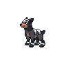

# 228 - Houndour

## Types

| Version | Type                                                          |
| :-----: | ------------------------------------------------------------: |
| Classic |   |

## Defenses

| Immune x0                            | Resistant ×¼ | Resistant ×½                                                                                                                                                                                                      | Normal ×1                                                                                                                                                                                                                                                                | Weak ×2                                                                                                                                               | Weak ×4 |
| ------------------------------------ | ------------ | ----------------------------------------------------------------------------------------------------------------------------------------------------------------------------------------------------------------- | ------------------------------------------------------------------------------------------------------------------------------------------------------------------------------------------------------------------------------------------------------------------------ | ----------------------------------------------------------------------------------------------------------------------------------------------------- | ------- |
|  |              |       |        |     |         |

## Abilities

| Version | Ability              |
| ------- | -------------------- |
| All     | Unnerve / Flash-Fire |

## Base Stats

| Version | HP | Atk | Def | SAtk | SDef | Spd | BST |
| ------- | -- | --- | --- | ---- | ---- | --- | --- |
| All     | 45 | 60  | 30  | 80   | 50   | 65  | 330 |

## Level Up Moves

| Level | Name         | Power | Accuracy | PP | Type                               | Damage Class                           |
| ----- | ------------ | ----- | -------- | -- | ---------------------------------- | -------------------------------------- |
| 1     | Leer         | -     | 100%     | 30 |  |      |
| 1     | Ember        | 40    | 100%     | 25 |      |    |
| 4     | Howl         | -     | -        | 40 |  |      |
| 8     | Smog         | 30    | 70%      | 20 |  |    |
| 13    | Roar         | -     | -        | 20 |  |      |
| 16    | Bite         | 60    | 100%     | 25 |      |  |
| 20    | Odor-Sleuth  | -     | -        | 40 |  |      |
| 25    | Beat-Up      | -     | 100%     | 10 |      |  |
| 28    | Fire-Fang    | 65    | 95%      | 15 |      |  |
| 32    | Feint-Attack | 60    | -        | 20 |      |  |
| 37    | Embargo      | -     | 100%     | 15 |      |      |
| 40    | Foul-Play    | 95    | 100%     | 15 |      |  |
| 44    | Flamethrower | 90    | 100%     | 15 |      |    |
| 49    | Crunch       | 80    | 100%     | 15 |      |  |
| 52    | Nasty-Plot   | -     | -        | 20 |      |      |
| 56    | Inferno      | 100   | 50%      | 5  |      |    |

## Learnable Moves

| Machine | Name         | Power | Accuracy | PP | Type                                   | Damage Class                           |
| ------- | ------------ | ----- | -------- | -- | -------------------------------------- | -------------------------------------- |
| TM06    | Toxic        | -     | 90%      | 10 |      |      |
| TM10    | Hidden-Power | 60    | 100%     | 15 |      |    |
| TM11    | Sunny-Day    | -     | -        | 5  |          |      |
| TM12    | Taunt        | -     | 100%     | 20 |          |      |
| TM17    | Protect      | -     | -        | 10 |      |      |
| TM21    | Frustration  | -     | 100%     | 20 |      |  |
| TM22    | Solar-Beam   | 120   | 100%     | 10 |        |    |
| TM27    | Return       | -     | 100%     | 20 |      |  |
| TM30    | Shadow-Ball  | 80    | 100%     | 15 |        |    |
| TM32    | Double-Team  | -     | -        | 15 |      |      |
| TM36    | Sludge-Bomb  | 90    | 100%     | 10 |      |    |
| TM38    | Fire-Blast   | 110   | 85%      | 5  |          |    |
| TM41    | Torment      | -     | 100%     | 15 |          |      |
| TM42    | Facade       | 70    | 100%     | 20 |      |  |
| TM43    | Flame-Charge | 50    | 100%     | 20 |          |  |
| TM44    | Rest         | -     | -        | 10 |    |      |
| TM45    | Attract      | -     | 100%     | 15 |      |      |
| TM46    | Thief        | 60    | 100%     | 25 |          |  |
| TM48    | Round        | 60    | 100%     | 15 |      |    |
| TM50    | Overheat     | 130   | 90%      | 5  |          |    |
| TM59    | Incinerate   | 50    | 100%     | 15 |          |    |
| TM60    | Sucker-Punch | 70    | 100%     | 5  |          |  |
| TM61    | Will-O-Wisp  | -     | 85%      | 15 |          |      |
| TM66    | Payback      | 50    | 100%     | 10 |          |  |
| TM67    | Retaliate    | 70    | 100%     | 5  |      |  |
| TM85    | Dream-Eater  | 100   | 100%     | 15 |    |    |
| TM87    | Swagger      | -     | 85%      | 15 |      |      |
| TM90    | Substitute   | -     | -        | 10 |      |      |
| TM94    | Rock-Smash   | 40    | 100%     | 15 |  |  |
| TM95    | Snarl        | 55    | 95%      | 15 |          |    |