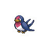

# 276 - Taillow

## Types

| Version | Type                                                                  |
| :-----: | --------------------------------------------------------------------: |
| Classic |   |

## Defenses

| Immune x0                                                               | Resistant ×¼ | Resistant ×½                                                      | Normal ×1                                                                                                                                                                                                                                                                                                                                                                                                                        | Weak ×2                                                                                                    | Weak ×4 |
| ----------------------------------------------------------------------- | ------------ | ----------------------------------------------------------------- | -------------------------------------------------------------------------------------------------------------------------------------------------------------------------------------------------------------------------------------------------------------------------------------------------------------------------------------------------------------------------------------------------------------------------------- | ---------------------------------------------------------------------------------------------------------- | ------- |
|   |              |   |            |    |         |

## Abilities

| Version | Ability        |
| ------- | -------------- |
| All     | Guts / Scrappy |

## Base Stats

| Version | HP | Atk | Def | SAtk | SDef | Spd | BST |
| ------- | -- | --- | --- | ---- | ---- | --- | --- |
| All     | 40 | 55  | 30  | 30   | 30   | 85  | 270 |

## Level Up Moves

| Level | Name         | Power | Accuracy | PP | Type                                 | Damage Class                           |
| ----- | ------------ | ----- | -------- | -- | ------------------------------------ | -------------------------------------- |
| 1     | Growl        | -     | 100%     | 40 |    |      |
| 1     | Peck         | 35    | 100%     | 35 |    |  |
| 4     | Focus-Energy | -     | -        | 30 |    |      |
| 8     | Quick-Attack | 40    | 100%     | 30 |    |  |
| 13    | Wing-Attack  | 60    | 100%     | 35 |    |  |
| 19    | Double-Team  | -     | -        | 15 |    |      |
| 26    | Endeavor     | -     | 100%     | 5  |    |  |
| 34    | Aerial-Ace   | 60    | -        | 20 |    |  |
| 43    | Agility      | -     | -        | 30 |  |      |
| 53    | Air-Slash    | 75    | 95%      | 15 |    |    |

## Learnable Moves

| Machine | Name         | Power | Accuracy | PP | Type                                 | Damage Class                           |
| ------- | ------------ | ----- | -------- | -- | ------------------------------------ | -------------------------------------- |
| HM02    | Fly          | 90    | 95%      | 15 |    |  |
| TM06    | Toxic        | -     | 90%      | 10 |    |      |
| TM10    | Hidden-Power | 60    | 100%     | 15 |    |    |
| TM11    | Sunny-Day    | -     | -        | 5  |        |      |
| TM17    | Protect      | -     | -        | 10 |    |      |
| TM18    | Rain-Dance   | -     | -        | 5  |      |      |
| TM21    | Frustration  | -     | 100%     | 20 |    |  |
| TM27    | Return       | -     | 100%     | 20 |    |  |
| TM42    | Facade       | 70    | 100%     | 20 |    |  |
| TM44    | Rest         | -     | -        | 10 |  |      |
| TM45    | Attract      | -     | 100%     | 15 |    |      |
| TM46    | Thief        | 60    | 100%     | 25 |        |  |
| TM48    | Round        | 60    | 100%     | 15 |    |    |
| TM49    | Echoed-Voice | 40    | 100%     | 15 |    |    |
| TM58    | Hurricane    | 110   | 70%      | 10 |    |    |
| TM62    | Acrobatics   | 55    | 100%     | 15 |    |  |
| TM83    | Work-Up      | -     | -        | 30 |    |      |
| TM87    | Swagger      | -     | 85%      | 15 |    |      |
| TM88    | Pluck        | 60    | 100%     | 20 |    |  |
| TM89    | U-Turn       | 70    | 100%     | 20 |          |  |
| TM90    | Substitute   | -     | -        | 10 |    |      |