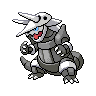

# 306 - Aggron

## Types

| Version | Type                                                            |
| :-----: | --------------------------------------------------------------: |
| Classic |   |

## Defenses

| Immune x0                          | Resistant ×¼                                                              | Resistant ×½                                                                                                                                                                                                          | Normal ×1                                                                                                                                                                                                                   | Weak ×2                          | Weak ×4                                                                       |
| ---------------------------------- | ------------------------------------------------------------------------- | --------------------------------------------------------------------------------------------------------------------------------------------------------------------------------------------------------------------- | --------------------------------------------------------------------------------------------------------------------------------------------------------------------------------------------------------------------------- | -------------------------------- | ----------------------------------------------------------------------------- |
|  |   |       |       |  |   |

## Abilities

| Version | Ability                          |
| ------- | -------------------------------- |
| All     | Sturdy / Rock-Head / Heavy-Metal |

## Base Stats

| Version | HP | Atk | Def | SAtk | SDef | Spd | BST |
| ------- | -- | --- | --- | ---- | ---- | --- | --- |
| All     | 70 | 110 | 180 | 60   | 60   | 50  | 530 |

## Level Up Moves

| Level | Name         | Power | Accuracy | PP | Type                               | Damage Class                           |
| ----- | ------------ | ----- | -------- | -- | ---------------------------------- | -------------------------------------- |
| 1     | Headbutt     | 70    | 100%     | 15 |  |  |
| 1     | Tackle       | 40    | 100%     | 35 |  |  |
| 1     | Harden       | -     | -        | 30 |  |      |
| 1     | Mud-Slap     | 20    | 100%     | 10 |  |    |
| 15    | Metal-Claw   | 50    | 95%      | 35 |    |  |
| 18    | Iron-Defense | -     | -        | 15 |    |      |
| 22    | Roar         | -     | -        | 20 |  |      |
| 25    | Take-Down    | 90    | 85%      | 20 |  |  |
| 29    | Iron-Head    | 80    | 100%     | 15 |    |  |
| 34    | Protect      | -     | -        | 10 |  |      |
| 40    | Metal-Sound  | -     | 85%      | 40 |    |      |
| 48    | Iron-Tail    | 100   | 75%      | 15 |    |  |
| 57    | Autotomize   | -     | -        | 15 |    |      |
| 65    | Heavy-Slam   | -     | 100%     | 10 |    |  |
| 74    | Double-Edge  | 120   | 100%     | 15 |  |  |
| 82    | Metal-Burst  | -     | 100%     | 10 |    |  |

## Learnable Moves

| Machine | Name         | Power | Accuracy | PP | Type                                   | Damage Class                           |
| ------- | ------------ | ----- | -------- | -- | -------------------------------------- | -------------------------------------- |
| HM01    | Cut          | 60    | 100%     | 20 |        |  |
| HM03    | Surf         | 90    | 100%     | 15 |        |    |
| HM04    | Strength     | 75    | 100%     | 15 |          |  |
| TM01    | Hone-Claws   | -     | -        | 15 |          |      |
| TM02    | Dragon-Claw  | 80    | 100%     | 15 |      |  |
| TM06    | Toxic        | -     | 90%      | 10 |      |      |
| TM10    | Hidden-Power | 60    | 100%     | 15 |      |    |
| TM11    | Sunny-Day    | -     | -        | 5  |          |      |
| TM12    | Taunt        | -     | 100%     | 20 |          |      |
| TM13    | Ice-Beam     | 90    | 100%     | 10 |            |    |
| TM14    | Blizzard     | 110   | 70%      | 5  |            |    |
| TM15    | Hyper-Beam   | 150   | 90%      | 5  |      |    |
| TM18    | Rain-Dance   | -     | -        | 5  |        |      |
| TM21    | Frustration  | -     | 100%     | 20 |      |  |
| TM22    | Solar-Beam   | 120   | 100%     | 10 |        |    |
| TM23    | Smack-Down   | 50    | 100%     | 15 |          |  |
| TM24    | Thunderbolt  | 90    | 100%     | 15 |  |    |
| TM25    | Thunder      | 110   | 70%      | 10 |  |    |
| TM26    | Earthquake   | 100   | 100%     | 10 |      |  |
| TM27    | Return       | -     | 100%     | 20 |      |  |
| TM28    | Dig          | 80    | 100%     | 10 |      |  |
| TM31    | Brick-Break  | 75    | 100%     | 15 |  |  |
| TM32    | Double-Team  | -     | -        | 15 |      |      |
| TM35    | Flamethrower | 90    | 100%     | 15 |          |    |
| TM37    | Sandstorm    | -     | -        | 10 |          |      |
| TM38    | Fire-Blast   | 110   | 85%      | 5  |          |    |
| TM39    | Rock-Tomb    | 60    | 95%      | 15 |          |  |
| TM40    | Aerial-Ace   | 60    | -        | 20 |      |  |
| TM42    | Facade       | 70    | 100%     | 20 |      |  |
| TM44    | Rest         | -     | -        | 10 |    |      |
| TM45    | Attract      | -     | 100%     | 15 |      |      |
| TM48    | Round        | 60    | 100%     | 15 |      |    |
| TM52    | Focus-Blast  | 120   | 70%      | 5  |  |    |
| TM56    | Fling        | -     | 100%     | 10 |          |  |
| TM59    | Incinerate   | 50    | 100%     | 15 |          |    |
| TM65    | Shadow-Claw  | 90    | 100%     | 15 |        |  |
| TM66    | Payback      | 50    | 100%     | 10 |          |  |
| TM68    | Giga-Impact  | 150   | 90%      | 5  |      |  |
| TM69    | Rock-Polish  | -     | -        | 20 |          |      |
| TM71    | Stone-Edge   | 100   | 80%      | 5  |          |  |
| TM73    | Thunder-Wave | -     | 90%      | 20 |  |      |
| TM78    | Bulldoze     | 60    | 100%     | 20 |      |  |
| TM80    | Rock-Slide   | 75    | 90%      | 10 |          |  |
| TM82    | Dragon-Tail  | 60    | 90%      | 10 |      |  |
| TM87    | Swagger      | -     | 85%      | 15 |      |      |
| TM90    | Substitute   | -     | -        | 10 |      |      |
| TM91    | Flash-Cannon | 80    | 100%     | 10 |        |    |
| TM94    | Rock-Smash   | 40    | 100%     | 15 |  |  |