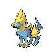

# 310 - Manectric

## Types

| Version | Type                                   |
| :-----: | -------------------------------------: |
| Classic |  |

## Defenses

| Immune x0 | Resistant ×¼ | Resistant ×½                                                                                                       | Normal ×1                                                                                                                                                                                                                                                                                                                                                                                                                                                                                                                           | Weak ×2                            | Weak ×4 |
| --------- | ------------ | ------------------------------------------------------------------------------------------------------------------ | ----------------------------------------------------------------------------------------------------------------------------------------------------------------------------------------------------------------------------------------------------------------------------------------------------------------------------------------------------------------------------------------------------------------------------------------------------------------------------------------------------------------------------------- | ---------------------------------- | ------- |
|           |              |    |               |  |         |

## Abilities

| Version | Ability                        |
| ------- | ------------------------------ |
| All     | Static / Lightning-Rod / Minus |

## Base Stats

| Version | HP | Atk | Def | SAtk | SDef | Spd | BST |
| ------- | -- | --- | --- | ---- | ---- | --- | --- |
| All     | 70 | 75  | 60  | 105  | 60   | 105 | 475 |

## Level Up Moves

| Level | Name         | Power | Accuracy | PP | Type                                   | Damage Class                           |
| ----- | ------------ | ----- | -------- | -- | -------------------------------------- | -------------------------------------- |
| 1     | Tackle       | 40    | 100%     | 35 |      |  |
| 1     | Leer         | -     | 100%     | 30 |      |      |
| 1     | Thunder-Wave | -     | 90%      | 20 |  |      |
| 1     | Howl         | -     | -        | 40 |      |      |
| 1     | Fire-Fang    | 65    | 95%      | 15 |          |  |
| 17    | Quick-Attack | 40    | 100%     | 30 |      |  |
| 20    | Spark        | 65    | 100%     | 20 |  |  |
| 25    | Odor-Sleuth  | -     | -        | 40 |      |      |
| 30    | Bite         | 60    | 100%     | 25 |          |  |
| 37    | Thunder-Fang | 65    | 95%      | 15 |  |  |
| 42    | Roar         | -     | -        | 20 |      |      |
| 49    | Discharge    | 80    | 100%     | 15 |  |    |
| 54    | Charge       | -     | -        | 20 |  |      |
| 61    | Wild-Charge  | 90    | 100%     | 15 |  |  |
| 66    | Thunder      | 110   | 70%      | 10 |  |    |

## Learnable Moves

| Machine | Name         | Power | Accuracy | PP | Type                                   | Damage Class                           |
| ------- | ------------ | ----- | -------- | -- | -------------------------------------- | -------------------------------------- |
| HM04    | Strength     | 75    | 100%     | 15 |          |  |
| TM06    | Toxic        | -     | 90%      | 10 |      |      |
| TM10    | Hidden-Power | 60    | 100%     | 15 |      |    |
| TM15    | Hyper-Beam   | 150   | 90%      | 5  |      |    |
| TM16    | Light-Screen | -     | -        | 30 |    |      |
| TM17    | Protect      | -     | -        | 10 |      |      |
| TM18    | Rain-Dance   | -     | -        | 5  |        |      |
| TM21    | Frustration  | -     | 100%     | 20 |      |  |
| TM24    | Thunderbolt  | 90    | 100%     | 15 |  |    |
| TM27    | Return       | -     | 100%     | 20 |      |  |
| TM32    | Double-Team  | -     | -        | 15 |      |      |
| TM35    | Flamethrower | 90    | 100%     | 15 |          |    |
| TM42    | Facade       | 70    | 100%     | 20 |      |  |
| TM44    | Rest         | -     | -        | 10 |    |      |
| TM45    | Attract      | -     | 100%     | 15 |      |      |
| TM46    | Thief        | 60    | 100%     | 25 |          |  |
| TM48    | Round        | 60    | 100%     | 15 |      |    |
| TM50    | Overheat     | 130   | 90%      | 5  |          |    |
| TM57    | Charge-Beam  | 50    | 90%      | 10 |  |    |
| TM68    | Giga-Impact  | 150   | 90%      | 5  |      |  |
| TM70    | Flash        | -     | 100%     | 20 |      |      |
| TM72    | Volt-Switch  | 70    | 100%     | 20 |  |    |
| TM87    | Swagger      | -     | 85%      | 15 |      |      |
| TM90    | Substitute   | -     | -        | 10 |      |      |
| TM95    | Snarl        | 55    | 95%      | 15 |          |    |