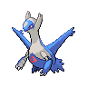

# 381 - Latios

## Types

| Version | Type                                                                    |
| :-----: | ----------------------------------------------------------------------: |
| Classic |   |

## Defenses

| Immune x0 | Resistant ×¼ | Resistant ×½                                                                                                                                                                                                                            | Normal ×1                                                                                                                                                                                                                       | Weak ×2                                                                                                                                                                                                           | Weak ×4 |
| --------- | ------------ | --------------------------------------------------------------------------------------------------------------------------------------------------------------------------------------------------------------------------------------- | ------------------------------------------------------------------------------------------------------------------------------------------------------------------------------------------------------------------------------- | ----------------------------------------------------------------------------------------------------------------------------------------------------------------------------------------------------------------- | ------- |
|           |              |       |       |       |         |

## Abilities

| Version | Ability  |
| ------- | -------- |
| All     | Levitate |

## Base Stats

| Version | HP | Atk | Def | SAtk | SDef | Spd | BST |
| ------- | -- | --- | --- | ---- | ---- | --- | --- |
| All     | 80 | 90  | 80  | 130  | 110  | 110 | 600 |

## Level Up Moves

| Level | Name          | Power | Accuracy | PP | Type                                 | Damage Class                           |
| ----- | ------------- | ----- | -------- | -- | ------------------------------------ | -------------------------------------- |
| 1     | Psywave       | -     | 100%     | 15 |  |    |
| 5     | Heal-Block    | -     | 100%     | 15 |  |      |
| 10    | Helping-Hand  | -     | -        | 20 |    |      |
| 15    | Safeguard     | -     | -        | 25 |    |      |
| 20    | Dragon-Breath | 60    | 100%     | 20 |    |    |
| 25    | Protect       | -     | -        | 10 |    |      |
| 30    | Refresh       | -     | -        | 20 |    |      |
| 35    | Luster-Purge  | 95    | 100%     | 5  |  |    |
| 40    | Zen-Headbutt  | 80    | 90%      | 15 |  |  |
| 45    | Recover       | -     | -        | 10 |    |      |
| 50    | Psycho-Shift  | -     | 100%     | 10 |  |      |
| 55    | Dragon-Dance  | -     | -        | 20 |    |      |
| 60    | Psychic       | 90    | 100%     | 10 |  |    |
| 65    | Heal-Pulse    | -     | -        | 10 |  |      |
| 70    | Telekinesis   | -     | -        | 15 |  |      |
| 75    | Power-Split   | -     | -        | 10 |  |      |
| 80    | Dragon-Pulse  | 85    | 100%     | 10 |    |    |
| 85    | Memento       | -     | 100%     | 10 |        |      |

## Learnable Moves

| Machine | Name         | Power | Accuracy | PP | Type                                   | Damage Class                           |
| ------- | ------------ | ----- | -------- | -- | -------------------------------------- | -------------------------------------- |
| HM01    | Cut          | 60    | 100%     | 20 |        |  |
| HM02    | Fly          | 90    | 95%      | 15 |      |  |
| HM03    | Surf         | 90    | 100%     | 15 |        |    |
| HM05    | Waterfall    | 80    | 100%     | 15 |        |  |
| HM06    | Dive         | 80    | 100%     | 10 |        |  |
| TM01    | Hone-Claws   | -     | -        | 15 |          |      |
| TM02    | Dragon-Claw  | 80    | 100%     | 15 |      |  |
| TM03    | Psyshock     | 80    | 100%     | 10 |    |    |
| TM04    | Calm-Mind    | -     | -        | 20 |    |      |
| TM05    | Roar         | -     | -        | 20 |      |      |
| TM06    | Toxic        | -     | 90%      | 10 |      |      |
| TM10    | Hidden-Power | 60    | 100%     | 15 |      |    |
| TM11    | Sunny-Day    | -     | -        | 5  |          |      |
| TM13    | Ice-Beam     | 90    | 100%     | 10 |            |    |
| TM15    | Hyper-Beam   | 150   | 90%      | 5  |      |    |
| TM16    | Light-Screen | -     | -        | 30 |    |      |
| TM18    | Rain-Dance   | -     | -        | 5  |        |      |
| TM21    | Frustration  | -     | 100%     | 20 |      |  |
| TM22    | Solar-Beam   | 120   | 100%     | 10 |        |    |
| TM24    | Thunderbolt  | 90    | 100%     | 15 |  |    |
| TM25    | Thunder      | 110   | 70%      | 10 |  |    |
| TM26    | Earthquake   | 100   | 100%     | 10 |      |  |
| TM27    | Return       | -     | 100%     | 20 |      |  |
| TM30    | Shadow-Ball  | 80    | 100%     | 15 |        |    |
| TM32    | Double-Team  | -     | -        | 15 |      |      |
| TM33    | Reflect      | -     | -        | 20 |    |      |
| TM37    | Sandstorm    | -     | -        | 10 |          |      |
| TM40    | Aerial-Ace   | 60    | -        | 20 |      |  |
| TM42    | Facade       | 70    | 100%     | 20 |      |  |
| TM44    | Rest         | -     | -        | 10 |    |      |
| TM45    | Attract      | -     | 100%     | 15 |      |      |
| TM48    | Round        | 60    | 100%     | 15 |      |    |
| TM53    | Energy-Ball  | 90    | 100%     | 10 |        |    |
| TM57    | Charge-Beam  | 50    | 90%      | 10 |  |    |
| TM65    | Shadow-Claw  | 90    | 100%     | 15 |        |  |
| TM67    | Retaliate    | 70    | 100%     | 5  |      |  |
| TM68    | Giga-Impact  | 150   | 90%      | 5  |      |  |
| TM70    | Flash        | -     | 100%     | 20 |      |      |
| TM73    | Thunder-Wave | -     | 90%      | 20 |  |      |
| TM77    | Psych-Up     | -     | -        | 10 |      |      |
| TM78    | Bulldoze     | 60    | 100%     | 20 |      |  |
| TM85    | Dream-Eater  | 100   | 100%     | 15 |    |    |
| TM86    | Grass-Knot   | -     | 100%     | 20 |        |    |
| TM87    | Swagger      | -     | 85%      | 15 |      |      |
| TM90    | Substitute   | -     | -        | 10 |      |      |