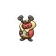

# 401 - Kricketot

## Types

| Version | Type                         |
| :-----: | ---------------------------: |
| Classic |  |

## Defenses

| Immune x0 | Resistant ×¼ | Resistant ×½                                                                                                       | Normal ×1                                                                                                                                                                                                                                                                                                                                                                                                                                                     | Weak ×2                                                                                                  | Weak ×4 |
| --------- | ------------ | ------------------------------------------------------------------------------------------------------------------ | ------------------------------------------------------------------------------------------------------------------------------------------------------------------------------------------------------------------------------------------------------------------------------------------------------------------------------------------------------------------------------------------------------------------------------------------------------------- | -------------------------------------------------------------------------------------------------------- | ------- |
|           |              |    |             |    |         |

## Abilities

| Version | Ability              |
| ------- | -------------------- |
| All     | Shed-Skin / Run-Away |

## Base Stats

| Version | HP | Atk | Def | SAtk | SDef | Spd | BST |
| ------- | -- | --- | --- | ---- | ---- | --- | --- |
| All     | 37 | 25  | 41  | 25   | 41   | 25  | 194 |

## Level Up Moves

| Level | Name         | Power | Accuracy | PP | Type                               | Damage Class                           |
| ----- | ------------ | ----- | -------- | -- | ---------------------------------- | -------------------------------------- |
| 1     | Growl        | -     | 100%     | 40 |  |      |
| 1     | Bide         | -     | -        | 10 |  |  |
| 6     | Struggle-Bug | 50    | 100%     | 20 |        |    |
| 16    | Bug-Bite     | 60    | 100%     | 20 |        |  |

## Learnable Moves

| Machine | Name | Power | Accuracy | PP | Type | Damage Class |
| ------- | ---- | ----- | -------- | -- | ---- | ------------ |