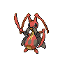

# 402 - Kricketune

## Types

| Version | Type                         |
| :-----: | ---------------------------: |
| Classic |  |

## Defenses

| Immune x0 | Resistant ×¼ | Resistant ×½                                                                                                       | Normal ×1                                                                                                                                                                                                                                                                                                                                                                                                                                                     | Weak ×2                                                                                                  | Weak ×4 |
| --------- | ------------ | ------------------------------------------------------------------------------------------------------------------ | ------------------------------------------------------------------------------------------------------------------------------------------------------------------------------------------------------------------------------------------------------------------------------------------------------------------------------------------------------------------------------------------------------------------------------------------------------------- | -------------------------------------------------------------------------------------------------------- | ------- |
|           |              |    |             |    |         |

## Abilities

| Version | Ability            |
| ------- | ------------------ |
| All     | Swarm / Technician |

## Base Stats

| Version | HP | Atk | Def | SAtk | SDef | Spd | BST |
| ------- | -- | --- | --- | ---- | ---- | --- | --- |
| All     | 77 | 111 | 71  | 55   | 71   | 81  | 466 |

## Level Up Moves

| Level | Name         | Power | Accuracy | PP | Type                               | Damage Class                           |
| ----- | ------------ | ----- | -------- | -- | ---------------------------------- | -------------------------------------- |
| 1     | Growl        | -     | 100%     | 40 |  |      |
| 1     | Bide         | -     | -        | 10 |  |  |
| 10    | Fury-Cutter  | 40    | 95%      | 20 |        |  |
| 14    | Leech-Life   | 80    | 100%     | 10 |        |  |
| 18    | Sing         | -     | 55%      | 15 |  |      |
| 22    | Focus-Energy | -     | -        | 30 |  |      |
| 26    | Slash        | 70    | 100%     | 20 |  |  |
| 30    | X-Scissor    | 80    | 100%     | 15 |        |  |
| 34    | Screech      | -     | 85%      | 40 |  |      |
| 38    | Taunt        | -     | 100%     | 20 |      |      |
| 42    | Night-Slash  | 70    | 100%     | 15 |      |  |
| 46    | Bug-Buzz     | 90    | 100%     | 10 |        |    |
| 50    | Perish-Song  | -     | -        | 5  |  |      |

## Learnable Moves

| Machine | Name         | Power | Accuracy | PP | Type                                   | Damage Class                           |
| ------- | ------------ | ----- | -------- | -- | -------------------------------------- | -------------------------------------- |
| HM01    | Cut          | 60    | 100%     | 20 |        |  |
| HM04    | Strength     | 75    | 100%     | 15 |          |  |
| TM01    | Hone-Claws   | -     | -        | 15 |          |      |
| TM06    | Toxic        | -     | 90%      | 10 |      |      |
| TM10    | Hidden-Power | 60    | 100%     | 15 |      |    |
| TM11    | Sunny-Day    | -     | -        | 5  |          |      |
| TM15    | Hyper-Beam   | 150   | 90%      | 5  |      |    |
| TM17    | Protect      | -     | -        | 10 |      |      |
| TM18    | Rain-Dance   | -     | -        | 5  |        |      |
| TM21    | Frustration  | -     | 100%     | 20 |      |  |
| TM27    | Return       | -     | 100%     | 20 |      |  |
| TM31    | Brick-Break  | 75    | 100%     | 15 |  |  |
| TM32    | Double-Team  | -     | -        | 15 |      |      |
| TM40    | Aerial-Ace   | 60    | -        | 20 |      |  |
| TM42    | Facade       | 70    | 100%     | 20 |      |  |
| TM44    | Rest         | -     | -        | 10 |    |      |
| TM45    | Attract      | -     | 100%     | 15 |      |      |
| TM48    | Round        | 60    | 100%     | 15 |      |    |
| TM49    | Echoed-Voice | 40    | 100%     | 15 |      |    |
| TM54    | False-Swipe  | 40    | 100%     | 40 |      |  |
| TM68    | Giga-Impact  | 150   | 90%      | 5  |      |  |
| TM70    | Flash        | -     | 100%     | 20 |      |      |
| TM75    | Swords-Dance | -     | -        | 20 |      |      |
| TM76    | Bug-Buzz     | 90    | 100%     | 10 |            |    |
| TM76    | Struggle-Bug | 50    | 100%     | 20 |            |    |
| TM87    | Swagger      | -     | 85%      | 15 |      |      |
| TM90    | Substitute   | -     | -        | 10 |      |      |
| TM94    | Rock-Smash   | 40    | 100%     | 15 |  |  |