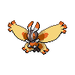

# 414 - Mothim

## Types

| Version | Type                                                            |
| :-----: | --------------------------------------------------------------: |
| Classic |   |

## Defenses

| Immune x0                          | Resistant ×¼                                                                | Resistant ×½                 | Normal ×1                                                                                                                                                                                                                                                                                                                                        | Weak ×2                                                                                                                                           | Weak ×4                        |
| ---------------------------------- | --------------------------------------------------------------------------- | ---------------------------- | ------------------------------------------------------------------------------------------------------------------------------------------------------------------------------------------------------------------------------------------------------------------------------------------------------------------------------------------------ | ------------------------------------------------------------------------------------------------------------------------------------------------- | ------------------------------ |
|  |   |  |          |     |  |

## Abilities

| Version | Ability             |
| ------- | ------------------- |
| All     | Swarm / Tinted-Lens |

## Base Stats

| Version | HP | Atk | Def | SAtk | SDef | Spd | BST |
| ------- | -- | --- | --- | ---- | ---- | --- | --- |
| All     | 70 | 109 | 50  | 109  | 50   | 96  | 484 |

## Level Up Moves

| Level | Name          | Power | Accuracy | PP | Type                                 | Damage Class                           |
| ----- | ------------- | ----- | -------- | -- | ------------------------------------ | -------------------------------------- |
| 1     | Tackle        | 40    | 100%     | 35 |    |  |
| 10    | Protect       | -     | -        | 10 |    |      |
| 15    | Bug-Bite      | 60    | 100%     | 20 |          |  |
| 20    | Hidden-Power  | 60    | 100%     | 15 |    |    |
| 23    | Confusion     | 50    | 100%     | 25 |  |    |
| 26    | Gust          | 40    | 100%     | 35 |    |    |
| 29    | Poison-Powder | -     | 75%      | 35 |    |      |
| 32    | Psybeam       | 65    | 100%     | 20 |  |    |
| 35    | Camouflage    | -     | -        | 20 |    |      |
| 38    | Silver-Wind   | 60    | 100%     | 5  |          |    |
| 41    | Air-Slash     | 75    | 95%      | 15 |    |    |
| 44    | Psychic       | 90    | 100%     | 10 |  |    |
| 47    | Bug-Buzz      | 90    | 100%     | 10 |          |    |
| 50    | Quiver-Dance  | -     | -        | 20 |          |      |

## Learnable Moves

| Machine | Name         | Power | Accuracy | PP | Type                                 | Damage Class                           |
| ------- | ------------ | ----- | -------- | -- | ------------------------------------ | -------------------------------------- |
| TM06    | Toxic        | -     | 90%      | 10 |    |      |
| TM09    | Venoshock    | 65    | 100%     | 10 |    |    |
| TM11    | Sunny-Day    | -     | -        | 5  |        |      |
| TM15    | Hyper-Beam   | 150   | 90%      | 5  |    |    |
| TM18    | Rain-Dance   | -     | -        | 5  |      |      |
| TM20    | Safeguard    | -     | -        | 25 |    |      |
| TM21    | Frustration  | -     | 100%     | 20 |    |  |
| TM22    | Solar-Beam   | 120   | 100%     | 10 |      |    |
| TM27    | Return       | -     | 100%     | 20 |    |  |
| TM30    | Shadow-Ball  | 80    | 100%     | 15 |      |    |
| TM32    | Double-Team  | -     | -        | 15 |    |      |
| TM40    | Aerial-Ace   | 60    | -        | 20 |    |  |
| TM42    | Facade       | 70    | 100%     | 20 |    |  |
| TM44    | Rest         | -     | -        | 10 |  |      |
| TM45    | Attract      | -     | 100%     | 15 |    |      |
| TM46    | Thief        | 60    | 100%     | 25 |        |  |
| TM48    | Round        | 60    | 100%     | 15 |    |    |
| TM53    | Energy-Ball  | 90    | 100%     | 10 |      |    |
| TM58    | Hurricane    | 110   | 70%      | 10 |    |    |
| TM62    | Acrobatics   | 55    | 100%     | 15 |    |  |
| TM68    | Giga-Impact  | 150   | 90%      | 5  |    |  |
| TM70    | Flash        | -     | 100%     | 20 |    |      |
| TM76    | Bug-Buzz     | 90    | 100%     | 10 |          |    |
| TM76    | Struggle-Bug | 50    | 100%     | 20 |          |    |
| TM77    | Psych-Up     | -     | -        | 10 |    |      |
| TM85    | Dream-Eater  | 100   | 100%     | 15 |  |    |
| TM87    | Swagger      | -     | 85%      | 15 |    |      |
| TM89    | U-Turn       | 70    | 100%     | 20 |          |  |
| TM90    | Substitute   | -     | -        | 10 |    |      |