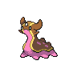

# 423 - Gastrodon

## Types

| Version | Type                                                                |
| :-----: | ------------------------------------------------------------------: |
| Classic |   |

## Defenses

| Immune x0                              | Resistant ×¼ | Resistant ×½                                                                                                                                  | Normal ×1                                                                                                                                                                                                                                                                                                                                                                                                                                                       | Weak ×2 | Weak ×4                          |
| -------------------------------------- | ------------ | --------------------------------------------------------------------------------------------------------------------------------------------- | --------------------------------------------------------------------------------------------------------------------------------------------------------------------------------------------------------------------------------------------------------------------------------------------------------------------------------------------------------------------------------------------------------------------------------------------------------------- | ------- | -------------------------------- |
|  |              |     |             |         |  |

## Abilities

| Version | Ability                                |
| ------- | -------------------------------------- |
| All     | Sticky-Hold / Storm-Drain / Sand-Force |

## Base Stats

| Version | HP  | Atk | Def | SAtk | SDef | Spd | BST |
| ------- | --- | --- | --- | ---- | ---- | --- | --- |
| All     | 111 | 83  | 68  | 92   | 82   | 39  | 475 |

## Level Up Moves

| Level | Name         | Power | Accuracy | PP | Type                               | Damage Class                           |
| ----- | ------------ | ----- | -------- | -- | ---------------------------------- | -------------------------------------- |
| 1     | Harden       | -     | -        | 30 |  |      |
| 1     | Mud-Slap     | 20    | 100%     | 10 |  |    |
| 1     | Mud-Sport    | -     | -        | 15 |  |      |
| 1     | Water-Pulse  | 60    | 100%     | 20 |    |    |
| 11    | Mud-Bomb     | 65    | 85%      | 10 |  |    |
| 16    | Hidden-Power | 60    | 100%     | 15 |  |    |
| 22    | Rain-Dance   | -     | -        | 5  |    |      |
| 29    | Body-Slam    | 85    | 100%     | 15 |  |  |
| 41    | Muddy-Water  | 90    | 85%      | 10 |    |    |
| 54    | Recover      | -     | -        | 10 |  |      |

## Learnable Moves

| Machine | Name        | Power | Accuracy | PP | Type                                   | Damage Class                           |
| ------- | ----------- | ----- | -------- | -- | -------------------------------------- | -------------------------------------- |
| HM03    | Surf        | 90    | 100%     | 15 |        |    |
| HM04    | Strength    | 75    | 100%     | 15 |          |  |
| HM05    | Waterfall   | 80    | 100%     | 15 |        |  |
| HM06    | Dive        | 80    | 100%     | 10 |        |  |
| TM06    | Toxic       | -     | 90%      | 10 |      |      |
| TM07    | Hail        | -     | -        | 10 |            |      |
| TM13    | Ice-Beam    | 90    | 100%     | 10 |            |    |
| TM14    | Blizzard    | 110   | 70%      | 5  |            |    |
| TM15    | Hyper-Beam  | 150   | 90%      | 5  |      |    |
| TM17    | Protect     | -     | -        | 10 |      |      |
| TM21    | Frustration | -     | 100%     | 20 |      |  |
| TM26    | Earthquake  | 100   | 100%     | 10 |      |  |
| TM27    | Return      | -     | 100%     | 20 |      |  |
| TM28    | Dig         | 80    | 100%     | 10 |      |  |
| TM32    | Double-Team | -     | -        | 15 |      |      |
| TM34    | Sludge-Wave | 95    | 100%     | 10 |      |    |
| TM36    | Sludge-Bomb | 90    | 100%     | 10 |      |    |
| TM37    | Sandstorm   | -     | -        | 10 |          |      |
| TM39    | Rock-Tomb   | 60    | 95%      | 15 |          |  |
| TM42    | Facade      | 70    | 100%     | 20 |      |  |
| TM44    | Rest        | -     | -        | 10 |    |      |
| TM45    | Attract     | -     | 100%     | 15 |      |      |
| TM48    | Round       | 60    | 100%     | 15 |      |    |
| TM55    | Scald       | 80    | 100%     | 15 |        |    |
| TM68    | Giga-Impact | 150   | 90%      | 5  |      |  |
| TM70    | Flash       | -     | 100%     | 20 |      |      |
| TM71    | Stone-Edge  | 100   | 80%      | 5  |          |  |
| TM78    | Bulldoze    | 60    | 100%     | 20 |      |  |
| TM80    | Rock-Slide  | 75    | 90%      | 10 |          |  |
| TM87    | Swagger     | -     | 85%      | 15 |      |      |
| TM90    | Substitute  | -     | -        | 10 |      |      |
| TM94    | Rock-Smash  | 40    | 100%     | 15 |  |  |