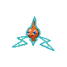

# 479 - Rotom

## Types

| Version | Type                                                                    |
| :-----: | ----------------------------------------------------------------------: |
| Classic |   |

## Defenses

| Immune x0                                                                     | Resistant ×¼ | Resistant ×½                                                                                                                                                                               | Normal ×1                                                                                                                                                                                                                                                                                         | Weak ×2                                                                                                    | Weak ×4 |
| ----------------------------------------------------------------------------- | ------------ | ------------------------------------------------------------------------------------------------------------------------------------------------------------------------------------------ | ------------------------------------------------------------------------------------------------------------------------------------------------------------------------------------------------------------------------------------------------------------------------------------------------- | ---------------------------------------------------------------------------------------------------------- | ------- |
|   |              |      |         |    |         |

## Abilities

| Version | Ability  |
| ------- | -------- |
| All     | Levitate |

## Base Stats

| Version | HP | Atk | Def | SAtk | SDef | Spd | BST |
| ------- | -- | --- | --- | ---- | ---- | --- | --- |
| All     | 50 | 50  | 77  | 100  | 77   | 96  | 450 |

## Level Up Moves

| Level | Name          | Power | Accuracy | PP | Type                                   | Damage Class                           |
| ----- | ------------- | ----- | -------- | -- | -------------------------------------- | -------------------------------------- |
| 1     | Thunder-Shock | 40    | 100%     | 30 |  |    |
| 1     | Thunder-Wave  | -     | 90%      | 20 |  |      |
| 1     | Confuse-Ray   | -     | 100%     | 10 |        |      |
| 1     | Trick         | -     | 100%     | 10 |    |      |
| 1     | Astonish      | 30    | 100%     | 15 |        |  |
| 8     | Uproar        | 90    | 100%     | 10 |      |    |
| 15    | Double-Team   | -     | -        | 15 |      |      |
| 22    | Shock-Wave    | 60    | -        | 20 |  |    |
| 29    | Ominous-Wind  | 60    | 100%     | 5  |        |    |
| 36    | Substitute    | -     | -        | 10 |      |      |
| 43    | Electro-Ball  | -     | 100%     | 10 |  |    |
| 50    | Hex           | 65    | 100%     | 10 |        |    |
| 57    | Charge        | -     | -        | 20 |  |      |
| 64    | Discharge     | 80    | 100%     | 15 |  |    |

## Learnable Moves

| Machine | Name         | Power | Accuracy | PP | Type                                   | Damage Class                           |
| ------- | ------------ | ----- | -------- | -- | -------------------------------------- | -------------------------------------- |
| TM06    | Toxic        | -     | 90%      | 10 |      |      |
| TM10    | Hidden-Power | 60    | 100%     | 15 |      |    |
| TM11    | Sunny-Day    | -     | -        | 5  |          |      |
| TM16    | Light-Screen | -     | -        | 30 |    |      |
| TM17    | Protect      | -     | -        | 10 |      |      |
| TM18    | Rain-Dance   | -     | -        | 5  |        |      |
| TM19    | Telekinesis  | -     | -        | 15 |    |      |
| TM21    | Frustration  | -     | 100%     | 20 |      |  |
| TM24    | Thunderbolt  | 90    | 100%     | 15 |  |    |
| TM25    | Thunder      | 110   | 70%      | 10 |  |    |
| TM27    | Return       | -     | 100%     | 20 |      |  |
| TM30    | Shadow-Ball  | 80    | 100%     | 15 |        |    |
| TM33    | Reflect      | -     | -        | 20 |    |      |
| TM42    | Facade       | 70    | 100%     | 20 |      |  |
| TM44    | Rest         | -     | -        | 10 |    |      |
| TM46    | Thief        | 60    | 100%     | 25 |          |  |
| TM48    | Round        | 60    | 100%     | 15 |      |    |
| TM57    | Charge-Beam  | 50    | 90%      | 10 |  |    |
| TM60    | Sucker-Punch | 70    | 100%     | 5  |          |  |
| TM61    | Will-O-Wisp  | -     | 85%      | 15 |          |      |
| TM70    | Flash        | -     | 100%     | 20 |      |      |
| TM72    | Volt-Switch  | 70    | 100%     | 20 |  |    |
| TM77    | Psych-Up     | -     | -        | 10 |      |      |
| TM85    | Dream-Eater  | 100   | 100%     | 15 |    |    |
| TM87    | Swagger      | -     | 85%      | 15 |      |      |