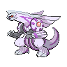

# 484 - Palkia

## Types

| Version | Type                                                                |
| :-----: | ------------------------------------------------------------------: |
| Classic |   |

## Defenses

| Immune x0 | Resistant ×¼                                                        | Resistant ×½                     | Normal ×1                                                                                                                                                                                                                                                                                                                                                                                                                                                                                                | Weak ×2                                                                 | Weak ×4 |
| --------- | ------------------------------------------------------------------- | -------------------------------- | -------------------------------------------------------------------------------------------------------------------------------------------------------------------------------------------------------------------------------------------------------------------------------------------------------------------------------------------------------------------------------------------------------------------------------------------------------------------------------------------------------- | ----------------------------------------------------------------------- | ------- |
|           |   |  |              |   |         |

## Abilities

| Version | Ability              |
| ------- | -------------------- |
| All     | Pressure / Telepathy |

## Base Stats

| Version | HP | Atk | Def | SAtk | SDef | Spd | BST |
| ------- | -- | --- | --- | ---- | ---- | --- | --- |
| All     | 90 | 120 | 100 | 150  | 120  | 100 | 680 |

## Level Up Moves

| Level | Name          | Power | Accuracy | PP | Type                                   | Damage Class                           |
| ----- | ------------- | ----- | -------- | -- | -------------------------------------- | -------------------------------------- |
| 1     | Scary-Face    | -     | 100%     | 10 |      |      |
| 1     | Dragon-Breath | 60    | 100%     | 20 |      |    |
| 6     | Water-Pulse   | 60    | 100%     | 20 |        |    |
| 10    | Ancient-Power | 60    | 100%     | 5  |          |    |
| 15    | Slash         | 70    | 100%     | 20 |      |  |
| 19    | Power-Gem     | 80    | 100%     | 20 |          |    |
| 24    | Aqua-Tail     | 90    | 90%      | 10 |        |  |
| 28    | Dragon-Claw   | 80    | 100%     | 15 |      |  |
| 33    | Earth-Power   | 90    | 100%     | 10 |      |    |
| 37    | Aura-Sphere   | 80    | -        | 20 |  |    |
| 46    | Spacial-Rend  | 100   | 95%      | 5  |      |    |
| 50    | Hydro-Pump    | 110   | 80%      | 5  |        |    |

## Learnable Moves

| Machine | Name         | Power | Accuracy | PP | Type                                   | Damage Class                           |
| ------- | ------------ | ----- | -------- | -- | -------------------------------------- | -------------------------------------- |
| HM01    | Cut          | 60    | 100%     | 20 |        |  |
| HM03    | Surf         | 90    | 100%     | 15 |        |    |
| HM04    | Strength     | 75    | 100%     | 15 |          |  |
| HM06    | Dive         | 80    | 100%     | 10 |        |  |
| TM01    | Hone-Claws   | -     | -        | 15 |          |      |
| TM05    | Roar         | -     | -        | 20 |      |      |
| TM06    | Toxic        | -     | 90%      | 10 |      |      |
| TM07    | Hail         | -     | -        | 10 |            |      |
| TM08    | Bulk-Up      | -     | -        | 20 |  |      |
| TM10    | Hidden-Power | 60    | 100%     | 15 |      |    |
| TM11    | Sunny-Day    | -     | -        | 5  |          |      |
| TM13    | Ice-Beam     | 90    | 100%     | 10 |            |    |
| TM14    | Blizzard     | 110   | 70%      | 5  |            |    |
| TM15    | Hyper-Beam   | 150   | 90%      | 5  |      |    |
| TM17    | Protect      | -     | -        | 10 |      |      |
| TM18    | Rain-Dance   | -     | -        | 5  |        |      |
| TM20    | Safeguard    | -     | -        | 25 |      |      |
| TM21    | Frustration  | -     | 100%     | 20 |      |  |
| TM24    | Thunderbolt  | 90    | 100%     | 15 |  |    |
| TM25    | Thunder      | 110   | 70%      | 10 |  |    |
| TM26    | Earthquake   | 100   | 100%     | 10 |      |  |
| TM27    | Return       | -     | 100%     | 20 |      |  |
| TM31    | Brick-Break  | 75    | 100%     | 15 |  |  |
| TM32    | Double-Team  | -     | -        | 15 |      |      |
| TM35    | Flamethrower | 90    | 100%     | 15 |          |    |
| TM37    | Sandstorm    | -     | -        | 10 |          |      |
| TM38    | Fire-Blast   | 110   | 85%      | 5  |          |    |
| TM39    | Rock-Tomb    | 60    | 95%      | 15 |          |  |
| TM40    | Aerial-Ace   | 60    | -        | 20 |      |  |
| TM42    | Facade       | 70    | 100%     | 20 |      |  |
| TM44    | Rest         | -     | -        | 10 |    |      |
| TM48    | Round        | 60    | 100%     | 15 |      |    |
| TM49    | Echoed-Voice | 40    | 100%     | 15 |      |    |
| TM52    | Focus-Blast  | 120   | 70%      | 5  |  |    |
| TM56    | Fling        | -     | 100%     | 10 |          |  |
| TM59    | Incinerate   | 50    | 100%     | 15 |          |    |
| TM65    | Shadow-Claw  | 90    | 100%     | 15 |        |  |
| TM68    | Giga-Impact  | 150   | 90%      | 5  |      |  |
| TM71    | Stone-Edge   | 100   | 80%      | 5  |          |  |
| TM73    | Thunder-Wave | -     | 90%      | 20 |  |      |
| TM77    | Psych-Up     | -     | -        | 10 |      |      |
| TM78    | Bulldoze     | 60    | 100%     | 20 |      |  |
| TM80    | Rock-Slide   | 75    | 90%      | 10 |          |  |
| TM82    | Dragon-Tail  | 60    | 90%      | 10 |      |  |
| TM87    | Swagger      | -     | 85%      | 15 |      |      |
| TM90    | Substitute   | -     | -        | 10 |      |      |
| TM92    | Trick-Room   | -     | -        | 5  |    |      |
| TM94    | Rock-Smash   | 40    | 100%     | 15 |  |  |