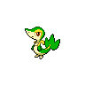

# 495 - Snivy

## Types

| Version | Type                             |
| :-----: | -------------------------------: |
| Classic |  |

## Defenses

| Immune x0 | Resistant ×¼ | Resistant ×½                                                                                                                                            | Normal ×1                                                                                                                                                                                                                                                                                                                                          | Weak ×2                                                                                                                                                                        | Weak ×4 |
| --------- | ------------ | ------------------------------------------------------------------------------------------------------------------------------------------------------- | -------------------------------------------------------------------------------------------------------------------------------------------------------------------------------------------------------------------------------------------------------------------------------------------------------------------------------------------------- | ------------------------------------------------------------------------------------------------------------------------------------------------------------------------------ | ------- |
|           |              |     |          |      |         |

## Abilities

| Version | Ability             |
| ------- | ------------------- |
| All     | Overgrow / Contrary |

## Base Stats

| Version | HP | Atk | Def | SAtk | SDef | Spd | BST |
| ------- | -- | --- | --- | ---- | ---- | --- | --- |
| All     | 45 | 45  | 55  | 45   | 55   | 63  | 308 |

## Level Up Moves

| Level | Name         | Power | Accuracy | PP | Type                               | Damage Class                           |
| ----- | ------------ | ----- | -------- | -- | ---------------------------------- | -------------------------------------- |
| 1     | Tackle       | 40    | 100%     | 35 |  |  |
| 4     | Leer         | -     | 100%     | 30 |  |      |
| 7     | Vine-Whip    | 45    | 100%     | 25 |    |  |
| 10    | Wrap         | 15    | 90%      | 20 |  |  |
| 13    | Growth       | -     | -        | 20 |  |      |
| 16    | Leaf-Tornado | 65    | 90%      | 10 |    |    |
| 19    | Leech-Seed   | -     | 90%      | 10 |    |      |
| 22    | Mega-Drain   | 40    | 100%     | 15 |    |    |
| 25    | Slam         | 80    | 75%      | 20 |  |  |
| 28    | Leaf-Blade   | 90    | 100%     | 15 |    |  |
| 31    | Coil         | -     | -        | 20 |  |      |
| 34    | Giga-Drain   | 75    | 100%     | 10 |    |    |
| 37    | Wring-Out    | -     | 100%     | 5  |  |    |
| 40    | Gastro-Acid  | -     | 100%     | 10 |  |      |
| 43    | Leaf-Storm   | 130   | 90%      | 5  |    |    |

## Learnable Moves

| Machine | Name         | Power | Accuracy | PP | Type                                 | Damage Class                           |
| ------- | ------------ | ----- | -------- | -- | ------------------------------------ | -------------------------------------- |
| HM01    | Cut          | 60    | 100%     | 20 |      |  |
| TM04    | Calm-Mind    | -     | -        | 20 |  |      |
| TM06    | Toxic        | -     | 90%      | 10 |    |      |
| TM10    | Hidden-Power | 60    | 100%     | 15 |    |    |
| TM11    | Sunny-Day    | -     | -        | 5  |        |      |
| TM12    | Taunt        | -     | 100%     | 20 |        |      |
| TM16    | Light-Screen | -     | -        | 30 |  |      |
| TM17    | Protect      | -     | -        | 10 |    |      |
| TM20    | Safeguard    | -     | -        | 25 |    |      |
| TM21    | Frustration  | -     | 100%     | 20 |    |  |
| TM22    | Solar-Beam   | 120   | 100%     | 10 |      |    |
| TM27    | Return       | -     | 100%     | 20 |    |  |
| TM32    | Double-Team  | -     | -        | 15 |    |      |
| TM33    | Reflect      | -     | -        | 20 |  |      |
| TM40    | Aerial-Ace   | 60    | -        | 20 |    |  |
| TM41    | Torment      | -     | 100%     | 15 |        |      |
| TM42    | Facade       | 70    | 100%     | 20 |    |  |
| TM44    | Rest         | -     | -        | 10 |  |      |
| TM45    | Attract      | -     | 100%     | 15 |    |      |
| TM48    | Round        | 60    | 100%     | 15 |    |    |
| TM53    | Energy-Ball  | 90    | 100%     | 10 |      |    |
| TM70    | Flash        | -     | 100%     | 20 |    |      |
| TM75    | Swords-Dance | -     | -        | 20 |    |      |
| TM86    | Grass-Knot   | -     | 100%     | 20 |      |    |
| TM87    | Swagger      | -     | 85%      | 15 |    |      |
| TM90    | Substitute   | -     | -        | 10 |    |      |