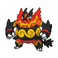

# 500 - Emboar

## Types

| Version | Type                                                                  |
| :-----: | --------------------------------------------------------------------: |
| Classic |   |

## Defenses

| Immune x0 | Resistant ×¼                 | Resistant ×½                                                                                                                                                                 | Normal ×1                                                                                                                                                                                                                                                                                                           | Weak ×2                                                                                                                                                 | Weak ×4 |
| --------- | ---------------------------- | ---------------------------------------------------------------------------------------------------------------------------------------------------------------------------- | ------------------------------------------------------------------------------------------------------------------------------------------------------------------------------------------------------------------------------------------------------------------------------------------------------------------- | ------------------------------------------------------------------------------------------------------------------------------------------------------- | ------- |
|           |  |      |         |     |         |

## Abilities

| Version | Ability              |
| ------- | -------------------- |
| All     | Blaze / Adaptability |

## Base Stats

| Version | HP  | Atk | Def | SAtk | SDef | Spd | BST |
| ------- | --- | --- | --- | ---- | ---- | --- | --- |
| All     | 115 | 125 | 80  | 70   | 80   | 65  | 535 |

## Level Up Moves

| Level | Name         | Power | Accuracy | PP | Type                                   | Damage Class                           |
| ----- | ------------ | ----- | -------- | -- | -------------------------------------- | -------------------------------------- |
| 1     | Tackle       | 40    | 100%     | 35 |      |  |
| 1     | Tail-Whip    | -     | 100%     | 30 |      |      |
| 1     | Ember        | 40    | 100%     | 25 |          |    |
| 1     | Odor-Sleuth  | -     | -        | 40 |      |      |
| 1     | Hammer-Arm   | 100   | 90%      | 10 |  |  |
| 13    | Defense-Curl | -     | -        | 40 |      |      |
| 15    | Flame-Charge | 50    | 100%     | 20 |          |  |
| 17    | Arm-Thrust   | 25    | 100%     | 20 |  |  |
| 20    | Smog         | 30    | 70%      | 20 |      |    |
| 23    | Rollout      | 30    | 90%      | 20 |          |  |
| 28    | Take-Down    | 90    | 85%      | 20 |      |  |
| 31    | Heat-Crash   | -     | 100%     | 10 |          |  |
| 38    | Assurance    | 60    | 100%     | 10 |          |  |
| 43    | Flamethrower | 90    | 100%     | 15 |          |    |
| 50    | Head-Smash   | 150   | 80%      | 5  |          |  |
| 55    | Roar         | -     | -        | 20 |      |      |
| 62    | Flare-Blitz  | 120   | 100%     | 15 |          |  |

## Learnable Moves

| Machine | Name         | Power | Accuracy | PP | Type                                   | Damage Class                           |
| ------- | ------------ | ----- | -------- | -- | -------------------------------------- | -------------------------------------- |
| HM04    | Strength     | 75    | 100%     | 15 |          |  |
| TM06    | Toxic        | -     | 90%      | 10 |      |      |
| TM08    | Bulk-Up      | -     | -        | 20 |  |      |
| TM10    | Hidden-Power | 60    | 100%     | 15 |      |    |
| TM11    | Sunny-Day    | -     | -        | 5  |          |      |
| TM12    | Taunt        | -     | 100%     | 20 |          |      |
| TM15    | Hyper-Beam   | 150   | 90%      | 5  |      |    |
| TM17    | Protect      | -     | -        | 10 |      |      |
| TM21    | Frustration  | -     | 100%     | 20 |      |  |
| TM22    | Solar-Beam   | 120   | 100%     | 10 |        |    |
| TM23    | Smack-Down   | 50    | 100%     | 15 |          |  |
| TM26    | Earthquake   | 100   | 100%     | 10 |      |  |
| TM27    | Return       | -     | 100%     | 20 |      |  |
| TM31    | Brick-Break  | 75    | 100%     | 15 |  |  |
| TM32    | Double-Team  | -     | -        | 15 |      |      |
| TM38    | Fire-Blast   | 110   | 85%      | 5  |          |    |
| TM39    | Rock-Tomb    | 60    | 95%      | 15 |          |  |
| TM42    | Facade       | 70    | 100%     | 20 |      |  |
| TM44    | Rest         | -     | -        | 10 |    |      |
| TM45    | Attract      | -     | 100%     | 15 |      |      |
| TM47    | Low-Sweep    | 65    | 100%     | 20 |  |  |
| TM48    | Round        | 60    | 100%     | 15 |      |    |
| TM49    | Echoed-Voice | 40    | 100%     | 15 |      |    |
| TM50    | Overheat     | 130   | 90%      | 5  |          |    |
| TM52    | Focus-Blast  | 120   | 70%      | 5  |  |    |
| TM55    | Scald        | 80    | 100%     | 15 |        |    |
| TM56    | Fling        | -     | 100%     | 10 |          |  |
| TM59    | Incinerate   | 50    | 100%     | 15 |          |    |
| TM60    | Sucker-Punch | 70    | 100%     | 5  |          |  |
| TM61    | Will-O-Wisp  | -     | 85%      | 15 |          |      |
| TM68    | Giga-Impact  | 150   | 90%      | 5  |      |  |
| TM71    | Stone-Edge   | 100   | 80%      | 5  |          |  |
| TM74    | Gyro-Ball    | -     | 100%     | 5  |        |  |
| TM78    | Bulldoze     | 60    | 100%     | 20 |      |  |
| TM80    | Rock-Slide   | 75    | 90%      | 10 |          |  |
| TM83    | Work-Up      | -     | -        | 30 |      |      |
| TM84    | Poison-Jab   | 80    | 100%     | 20 |      |  |
| TM86    | Grass-Knot   | -     | 100%     | 20 |        |    |
| TM87    | Swagger      | -     | 85%      | 15 |      |      |
| TM90    | Substitute   | -     | -        | 10 |      |      |
| TM93    | Wild-Charge  | 90    | 100%     | 15 |  |  |
| TM94    | Rock-Smash   | 40    | 100%     | 15 |  |  |