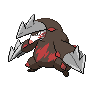

# 530 - Excadrill

## Types

| Version | Type                                                                |
| :-----: | ------------------------------------------------------------------: |
| Classic |   |

## Defenses

| Immune x0                                                                     | Resistant ×¼                   | Resistant ×½                                                                                                                                                                                                                                                         | Normal ×1                                                                                                                                 | Weak ×2                                                                                                                                               | Weak ×4 |
| ----------------------------------------------------------------------------- | ------------------------------ | -------------------------------------------------------------------------------------------------------------------------------------------------------------------------------------------------------------------------------------------------------------------- | ----------------------------------------------------------------------------------------------------------------------------------------- | ----------------------------------------------------------------------------------------------------------------------------------------------------- | ------- |
|   |  |        |     |     |         |

## Abilities

| Version | Ability                               |
| ------- | ------------------------------------- |
| All     | Sand-Rush / Sand-Force / Mold-Breaker |

## Base Stats

| Version | HP  | Atk | Def | SAtk | SDef | Spd | BST |
| ------- | --- | --- | --- | ---- | ---- | --- | --- |
| All     | 110 | 135 | 60  | 50   | 65   | 88  | 508 |

## Level Up Moves

| Level | Name         | Power | Accuracy | PP | Type                               | Damage Class                           |
| ----- | ------------ | ----- | -------- | -- | ---------------------------------- | -------------------------------------- |
| 1     | Scratch      | 40    | 100%     | 35 |  |  |
| 1     | Mud-Slap     | 20    | 100%     | 10 |  |    |
| 1     | Rapid-Spin   | 50    | 100%     | 40 |  |  |
| 1     | Mud-Sport    | -     | -        | 15 |  |      |
| 12    | Fury-Swipes  | 18    | 80%      | 15 |  |  |
| 15    | Metal-Claw   | 50    | 95%      | 35 |    |  |
| 19    | Dig          | 80    | 100%     | 10 |  |  |
| 22    | Hone-Claws   | -     | -        | 15 |      |      |
| 26    | Slash        | 70    | 100%     | 20 |  |  |
| 29    | Rock-Slide   | 75    | 90%      | 10 |      |  |
| 31    | Horn-Drill   | -     | 30%      | 5  |  |  |
| 36    | Earthquake   | 100   | 100%     | 10 |  |  |
| 42    | Swords-Dance | -     | -        | 20 |  |      |
| 49    | Sandstorm    | -     | -        | 10 |      |      |
| 55    | Drill-Run    | 80    | 95%      | 10 |  |  |
| 62    | Fissure      | -     | 30%      | 5  |  |  |

## Learnable Moves

| Machine | Name         | Power | Accuracy | PP | Type                                   | Damage Class                           |
| ------- | ------------ | ----- | -------- | -- | -------------------------------------- | -------------------------------------- |
| HM01    | Cut          | 60    | 100%     | 20 |        |  |
| HM04    | Strength     | 75    | 100%     | 15 |          |  |
| TM06    | Toxic        | -     | 90%      | 10 |      |      |
| TM10    | Hidden-Power | 60    | 100%     | 15 |      |    |
| TM15    | Hyper-Beam   | 150   | 90%      | 5  |      |    |
| TM17    | Protect      | -     | -        | 10 |      |      |
| TM21    | Frustration  | -     | 100%     | 20 |      |  |
| TM27    | Return       | -     | 100%     | 20 |      |  |
| TM31    | Brick-Break  | 75    | 100%     | 15 |  |  |
| TM32    | Double-Team  | -     | -        | 15 |      |      |
| TM36    | Sludge-Bomb  | 90    | 100%     | 10 |      |    |
| TM39    | Rock-Tomb    | 60    | 95%      | 15 |          |  |
| TM40    | Aerial-Ace   | 60    | -        | 20 |      |  |
| TM42    | Facade       | 70    | 100%     | 20 |      |  |
| TM44    | Rest         | -     | -        | 10 |    |      |
| TM45    | Attract      | -     | 100%     | 15 |      |      |
| TM48    | Round        | 60    | 100%     | 15 |      |    |
| TM52    | Focus-Blast  | 120   | 70%      | 5  |  |    |
| TM56    | Fling        | -     | 100%     | 10 |          |  |
| TM65    | Shadow-Claw  | 90    | 100%     | 15 |        |  |
| TM68    | Giga-Impact  | 150   | 90%      | 5  |      |  |
| TM78    | Bulldoze     | 60    | 100%     | 20 |      |  |
| TM81    | X-Scissor    | 80    | 100%     | 15 |            |  |
| TM84    | Poison-Jab   | 80    | 100%     | 20 |      |  |
| TM87    | Swagger      | -     | 85%      | 15 |      |      |
| TM90    | Substitute   | -     | -        | 10 |      |      |
| TM94    | Rock-Smash   | 40    | 100%     | 15 |  |  |