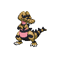

# 552 - Krokorok

## Types

| Version | Type                                                              |
| :-----: | ----------------------------------------------------------------: |
| Classic |   |

## Defenses

| Immune x0                                                                       | Resistant ×¼ | Resistant ×½                                                                                                                                  | Normal ×1                                                                                                                                                                                                                       | Weak ×2                                                                                                                                                                                                                 | Weak ×4 |
| ------------------------------------------------------------------------------- | ------------ | --------------------------------------------------------------------------------------------------------------------------------------------- | ------------------------------------------------------------------------------------------------------------------------------------------------------------------------------------------------------------------------------- | ----------------------------------------------------------------------------------------------------------------------------------------------------------------------------------------------------------------------- | ------- |
|   |              |     |       |       |         |

## Abilities

| Version | Ability                          |
| ------- | -------------------------------- |
| All     | Intimidate / Moxie / Anger-Point |

## Base Stats

| Version | HP | Atk | Def | SAtk | SDef | Spd | BST |
| ------- | -- | --- | --- | ---- | ---- | --- | --- |
| All     | 60 | 82  | 45  | 45   | 45   | 74  | 351 |

## Level Up Moves

| Level | Name        | Power | Accuracy | PP | Type                               | Damage Class                           |
| ----- | ----------- | ----- | -------- | -- | ---------------------------------- | -------------------------------------- |
| 1     | Sand-Attack | -     | 100%     | 15 |  |      |
| 1     | Leer        | -     | 100%     | 30 |  |      |
| 1     | Bite        | 60    | 100%     | 25 |      |  |
| 1     | Rage        | 20    | 100%     | 20 |  |  |
| 10    | Torment     | -     | 100%     | 15 |      |      |
| 13    | Sand-Tomb   | 35    | 85%      | 15 |  |  |
| 16    | Assurance   | 60    | 100%     | 10 |      |  |
| 19    | Mud-Slap    | 20    | 100%     | 10 |  |    |
| 22    | Embargo     | -     | 100%     | 15 |      |      |
| 25    | Swagger     | -     | 85%      | 15 |  |      |
| 28    | Crunch      | 80    | 100%     | 15 |      |  |
| 32    | Dig         | 80    | 100%     | 10 |  |  |
| 36    | Scary-Face  | -     | 100%     | 10 |  |      |
| 40    | Foul-Play   | 95    | 100%     | 15 |      |  |
| 44    | Sandstorm   | -     | -        | 10 |      |      |
| 48    | Earthquake  | 100   | 100%     | 10 |  |  |
| 52    | Thrash      | 120   | 100%     | 10 |  |  |

## Learnable Moves

| Machine | Name         | Power | Accuracy | PP | Type                                   | Damage Class                           |
| ------- | ------------ | ----- | -------- | -- | -------------------------------------- | -------------------------------------- |
| HM01    | Cut          | 60    | 100%     | 20 |        |  |
| HM04    | Strength     | 75    | 100%     | 15 |          |  |
| TM01    | Hone-Claws   | -     | -        | 15 |          |      |
| TM05    | Roar         | -     | -        | 20 |      |      |
| TM06    | Toxic        | -     | 90%      | 10 |      |      |
| TM10    | Hidden-Power | 60    | 100%     | 15 |      |    |
| TM12    | Taunt        | -     | 100%     | 20 |          |      |
| TM17    | Protect      | -     | -        | 10 |      |      |
| TM21    | Frustration  | -     | 100%     | 20 |      |  |
| TM27    | Return       | -     | 100%     | 20 |      |  |
| TM31    | Brick-Break  | 75    | 100%     | 15 |  |  |
| TM32    | Double-Team  | -     | -        | 15 |      |      |
| TM36    | Sludge-Bomb  | 90    | 100%     | 10 |      |    |
| TM39    | Rock-Tomb    | 60    | 95%      | 15 |          |  |
| TM42    | Facade       | 70    | 100%     | 20 |      |  |
| TM44    | Rest         | -     | -        | 10 |    |      |
| TM45    | Attract      | -     | 100%     | 15 |      |      |
| TM46    | Thief        | 60    | 100%     | 25 |          |  |
| TM47    | Low-Sweep    | 65    | 100%     | 20 |  |  |
| TM48    | Round        | 60    | 100%     | 15 |      |    |
| TM56    | Fling        | -     | 100%     | 10 |          |  |
| TM59    | Incinerate   | 50    | 100%     | 15 |          |    |
| TM60    | Sucker-Punch | 70    | 100%     | 5  |          |  |
| TM65    | Shadow-Claw  | 90    | 100%     | 15 |        |  |
| TM66    | Payback      | 50    | 100%     | 10 |          |  |
| TM67    | Retaliate    | 70    | 100%     | 5  |      |  |
| TM71    | Stone-Edge   | 100   | 80%      | 5  |          |  |
| TM78    | Bulldoze     | 60    | 100%     | 20 |      |  |
| TM80    | Rock-Slide   | 75    | 90%      | 10 |          |  |
| TM86    | Grass-Knot   | -     | 100%     | 20 |        |    |
| TM90    | Substitute   | -     | -        | 10 |      |      |
| TM94    | Rock-Smash   | 40    | 100%     | 15 |  |  |
| TM95    | Snarl        | 55    | 95%      | 15 |          |    |