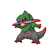

# 611 - Fraxure

## Types

| Version | Type                               |
| :-----: | ---------------------------------: |
| Classic |  |

## Defenses

| Immune x0 | Resistant ×¼ | Resistant ×½                                                                                                                                        | Normal ×1                                                                                                                                                                                                                                                                                                                                                                                                                    | Weak ×2                                                                                                  | Weak ×4 |
| --------- | ------------ | --------------------------------------------------------------------------------------------------------------------------------------------------- | ---------------------------------------------------------------------------------------------------------------------------------------------------------------------------------------------------------------------------------------------------------------------------------------------------------------------------------------------------------------------------------------------------------------------------- | -------------------------------------------------------------------------------------------------------- | ------- |
|           |              |     |            |    |         |

## Abilities

| Version | Ability                          |
| ------- | -------------------------------- |
| All     | Rivalry / Mold-Breaker / Unnerve |

## Base Stats

| Version | HP | Atk | Def | SAtk | SDef | Spd | BST |
| ------- | -- | --- | --- | ---- | ---- | --- | --- |
| All     | 66 | 117 | 70  | 40   | 50   | 67  | 410 |

## Level Up Moves

| Level | Name         | Power | Accuracy | PP | Type                               | Damage Class                           |
| ----- | ------------ | ----- | -------- | -- | ---------------------------------- | -------------------------------------- |
| 1     | Scratch      | 40    | 100%     | 35 |  |  |
| 1     | Leer         | -     | 100%     | 30 |  |      |
| 1     | Dragon-Rage  | -     | 100%     | 10 |  |    |
| 1     | Assurance    | 60    | 100%     | 10 |      |  |
| 13    | Dual-Chop    | 40    | 90%      | 15 |  |  |
| 16    | Scary-Face   | -     | 100%     | 10 |  |      |
| 20    | Slash        | 70    | 100%     | 20 |  |  |
| 24    | False-Swipe  | 40    | 100%     | 40 |  |  |
| 28    | Dragon-Claw  | 80    | 100%     | 15 |  |  |
| 32    | Dragon-Dance | -     | -        | 20 |  |      |
| 36    | Taunt        | -     | 100%     | 20 |      |      |
| 42    | Dragon-Pulse | 85    | 100%     | 10 |  |    |
| 48    | Swords-Dance | -     | -        | 20 |  |      |
| 54    | Guillotine   | -     | 30%      | 5  |  |  |
| 60    | Outrage      | 120   | 100%     | 10 |  |  |
| 66    | Giga-Impact  | 150   | 90%      | 5  |  |  |

## Learnable Moves

| Machine | Name         | Power | Accuracy | PP | Type                                   | Damage Class                           |
| ------- | ------------ | ----- | -------- | -- | -------------------------------------- | -------------------------------------- |
| HM01    | Cut          | 60    | 100%     | 20 |        |  |
| HM04    | Strength     | 75    | 100%     | 15 |          |  |
| TM01    | Hone-Claws   | -     | -        | 15 |          |      |
| TM05    | Roar         | -     | -        | 20 |      |      |
| TM06    | Toxic        | -     | 90%      | 10 |      |      |
| TM10    | Hidden-Power | 60    | 100%     | 15 |      |    |
| TM11    | Sunny-Day    | -     | -        | 5  |          |      |
| TM17    | Protect      | -     | -        | 10 |      |      |
| TM18    | Rain-Dance   | -     | -        | 5  |        |      |
| TM21    | Frustration  | -     | 100%     | 20 |      |  |
| TM27    | Return       | -     | 100%     | 20 |      |  |
| TM28    | Dig          | 80    | 100%     | 10 |      |  |
| TM32    | Double-Team  | -     | -        | 15 |      |      |
| TM39    | Rock-Tomb    | 60    | 95%      | 15 |          |  |
| TM40    | Aerial-Ace   | 60    | -        | 20 |      |  |
| TM42    | Facade       | 70    | 100%     | 20 |      |  |
| TM44    | Rest         | -     | -        | 10 |    |      |
| TM45    | Attract      | -     | 100%     | 15 |      |      |
| TM48    | Round        | 60    | 100%     | 15 |      |    |
| TM56    | Fling        | -     | 100%     | 10 |          |  |
| TM59    | Incinerate   | 50    | 100%     | 15 |          |    |
| TM65    | Shadow-Claw  | 90    | 100%     | 15 |        |  |
| TM66    | Payback      | 50    | 100%     | 10 |          |  |
| TM81    | X-Scissor    | 80    | 100%     | 15 |            |  |
| TM82    | Dragon-Tail  | 60    | 90%      | 10 |      |  |
| TM84    | Poison-Jab   | 80    | 100%     | 20 |      |  |
| TM87    | Swagger      | -     | 85%      | 15 |      |      |
| TM90    | Substitute   | -     | -        | 10 |      |      |
| TM94    | Rock-Smash   | 40    | 100%     | 15 |  |  |