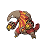

# 631 - Heatmor

## Types

| Version | Type                           |
| :-----: | -----------------------------: |
| Classic |  |

## Defenses

| Immune x0 | Resistant ×¼ | Resistant ×½                                                                                                                                                                                                    | Normal ×1                                                                                                                                                                                                                                                                                                                                                      | Weak ×2                                                                                                    | Weak ×4 |
| --------- | ------------ | --------------------------------------------------------------------------------------------------------------------------------------------------------------------------------------------------------------- | -------------------------------------------------------------------------------------------------------------------------------------------------------------------------------------------------------------------------------------------------------------------------------------------------------------------------------------------------------------- | ---------------------------------------------------------------------------------------------------------- | ------- |
|           |              |       |          |    |         |

## Abilities

| Version | Ability                  |
| ------- | ------------------------ |
| All     | White-Smoke / Flash-Fire |

## Base Stats

| Version | HP | Atk | Def | SAtk | SDef | Spd | BST |
| ------- | -- | --- | --- | ---- | ---- | --- | --- |
| All     | 85 | 97  | 66  | 105  | 66   | 65  | 484 |

## Level Up Moves

| Level | Name         | Power | Accuracy | PP | Type                                 | Damage Class                           |
| ----- | ------------ | ----- | -------- | -- | ------------------------------------ | -------------------------------------- |
| 1     | Lick         | 30    | 100%     | 30 |      |  |
| 1     | Incinerate   | 50    | 100%     | 15 |        |    |
| 6     | Odor-Sleuth  | -     | -        | 40 |    |      |
| 11    | Bind         | 15    | 85%      | 20 |    |  |
| 16    | Fire-Spin    | 35    | 85%      | 15 |        |    |
| 21    | Fury-Swipes  | 18    | 80%      | 15 |    |  |
| 26    | Snatch       | -     | -        | 10 |        |      |
| 31    | Flame-Burst  | 70    | 100%     | 15 |        |    |
| 36    | Bug-Bite     | 60    | 100%     | 20 |          |  |
| 41    | Slash        | 70    | 100%     | 20 |    |  |
| 46    | Amnesia      | -     | -        | 20 |  |      |
| 51    | Flamethrower | 90    | 100%     | 15 |        |    |
| 56    | Stockpile    | -     | -        | 20 |    |      |
| 56    | Spit-Up      | -     | 100%     | 10 |    |    |
| 56    | Swallow      | -     | -        | 10 |    |      |
| 61    | Inferno      | 100   | 50%      | 5  |        |    |

## Learnable Moves

| Machine | Name         | Power | Accuracy | PP | Type                                   | Damage Class                           |
| ------- | ------------ | ----- | -------- | -- | -------------------------------------- | -------------------------------------- |
| HM01    | Cut          | 60    | 100%     | 20 |        |  |
| TM01    | Hone-Claws   | -     | -        | 15 |          |      |
| TM06    | Toxic        | -     | 90%      | 10 |      |      |
| TM10    | Hidden-Power | 60    | 100%     | 15 |      |    |
| TM11    | Sunny-Day    | -     | -        | 5  |          |      |
| TM12    | Taunt        | -     | 100%     | 20 |          |      |
| TM17    | Protect      | -     | -        | 10 |      |      |
| TM18    | Rain-Dance   | -     | -        | 5  |        |      |
| TM21    | Frustration  | -     | 100%     | 20 |      |  |
| TM22    | Solar-Beam   | 120   | 100%     | 10 |        |    |
| TM27    | Return       | -     | 100%     | 20 |      |  |
| TM28    | Dig          | 80    | 100%     | 10 |      |  |
| TM32    | Double-Team  | -     | -        | 15 |      |      |
| TM38    | Fire-Blast   | 110   | 85%      | 5  |          |    |
| TM39    | Rock-Tomb    | 60    | 95%      | 15 |          |  |
| TM40    | Aerial-Ace   | 60    | -        | 20 |      |  |
| TM42    | Facade       | 70    | 100%     | 20 |      |  |
| TM44    | Rest         | -     | -        | 10 |    |      |
| TM45    | Attract      | -     | 100%     | 15 |      |      |
| TM46    | Thief        | 60    | 100%     | 25 |          |  |
| TM48    | Round        | 60    | 100%     | 15 |      |    |
| TM52    | Focus-Blast  | 120   | 70%      | 5  |  |    |
| TM56    | Fling        | -     | 100%     | 10 |          |  |
| TM60    | Sucker-Punch | 70    | 100%     | 5  |          |  |
| TM61    | Will-O-Wisp  | -     | 85%      | 15 |          |      |
| TM65    | Shadow-Claw  | 90    | 100%     | 15 |        |  |
| TM68    | Giga-Impact  | 150   | 90%      | 5  |      |  |
| TM87    | Swagger      | -     | 85%      | 15 |      |      |
| TM90    | Substitute   | -     | -        | 10 |      |      |
| TM94    | Rock-Smash   | 40    | 100%     | 15 |  |  |