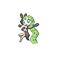

# 648 - Meloetta-Aria

## Types

| Version | Type                                                                    |
| :-----: | ----------------------------------------------------------------------: |
| Classic |   |

## Defenses

| Immune x0                        | Resistant ×¼ | Resistant ×½                         | Normal ×1                                                                                                                                                                                                                                                                                                                                                                                                                                                                                                                                       | Weak ×2                                                         | Weak ×4 |
| -------------------------------- | ------------ | ------------------------------------ | ----------------------------------------------------------------------------------------------------------------------------------------------------------------------------------------------------------------------------------------------------------------------------------------------------------------------------------------------------------------------------------------------------------------------------------------------------------------------------------------------------------------------------------------------- | --------------------------------------------------------------- | ------- |
|  |              |  |               |   |         |

## Abilities

| Version | Ability      |
| ------- | ------------ |
| All     | Serene-Grace |

## Base Stats

| Version | HP  | Atk | Def | SAtk | SDef | Spd | BST |
| ------- | --- | --- | --- | ---- | ---- | --- | --- |
| All     | 100 | 77  | 77  | 128  | 128  | 90  | 600 |

## Level Up Moves

| Level | Name         | Power | Accuracy | PP | Type                                   | Damage Class                           |
| ----- | ------------ | ----- | -------- | -- | -------------------------------------- | -------------------------------------- |
| 1     | Round        | 60    | 100%     | 15 |      |    |
| 6     | Quick-Attack | 40    | 100%     | 30 |      |  |
| 11    | Confusion    | 50    | 100%     | 25 |    |    |
| 16    | Sing         | -     | 55%      | 15 |      |      |
| 21    | Teeter-Dance | -     | 100%     | 20 |      |      |
| 26    | Acrobatics   | 55    | 100%     | 15 |      |  |
| 31    | Psybeam      | 65    | 100%     | 20 |    |    |
| 36    | Echoed-Voice | 40    | 100%     | 15 |      |    |
| 43    | U-Turn       | 70    | 100%     | 20 |            |  |
| 50    | Wake-Up-Slap | 70    | 100%     | 10 |  |  |
| 57    | Psychic      | 90    | 100%     | 10 |    |    |
| 64    | Hyper-Voice  | 90    | 100%     | 10 |      |    |
| 71    | Role-Play    | -     | -        | 10 |    |      |
| 78    | Close-Combat | 120   | 100%     | 5  |  |  |
| 85    | Perish-Song  | -     | -        | 5  |      |      |

## Learnable Moves

| Machine | Name         | Power | Accuracy | PP | Type                                   | Damage Class                           |
| ------- | ------------ | ----- | -------- | -- | -------------------------------------- | -------------------------------------- |
| HM04    | Strength     | 75    | 100%     | 15 |          |  |
| TM01    | Hone-Claws   | -     | -        | 15 |          |      |
| TM03    | Psyshock     | 80    | 100%     | 10 |    |    |
| TM04    | Calm-Mind    | -     | -        | 20 |    |      |
| TM06    | Toxic        | -     | 90%      | 10 |      |      |
| TM10    | Hidden-Power | 60    | 100%     | 15 |      |    |
| TM11    | Sunny-Day    | -     | -        | 5  |          |      |
| TM15    | Hyper-Beam   | 150   | 90%      | 5  |      |    |
| TM16    | Light-Screen | -     | -        | 30 |    |      |
| TM17    | Protect      | -     | -        | 10 |      |      |
| TM18    | Rain-Dance   | -     | -        | 5  |        |      |
| TM19    | Telekinesis  | -     | -        | 15 |    |      |
| TM20    | Safeguard    | -     | -        | 25 |      |      |
| TM21    | Frustration  | -     | 100%     | 20 |      |  |
| TM24    | Thunderbolt  | 90    | 100%     | 15 |  |    |
| TM25    | Thunder      | 110   | 70%      | 10 |  |    |
| TM27    | Return       | -     | 100%     | 20 |      |  |
| TM30    | Shadow-Ball  | 80    | 100%     | 15 |        |    |
| TM31    | Brick-Break  | 75    | 100%     | 15 |  |  |
| TM32    | Double-Team  | -     | -        | 15 |      |      |
| TM42    | Facade       | 70    | 100%     | 20 |      |  |
| TM44    | Rest         | -     | -        | 10 |    |      |
| TM47    | Low-Sweep    | 65    | 100%     | 20 |  |  |
| TM52    | Focus-Blast  | 120   | 70%      | 5  |  |    |
| TM53    | Energy-Ball  | 90    | 100%     | 10 |        |    |
| TM56    | Fling        | -     | 100%     | 10 |          |  |
| TM57    | Charge-Beam  | 50    | 90%      | 10 |  |    |
| TM63    | Embargo      | -     | 100%     | 15 |          |      |
| TM65    | Shadow-Claw  | 90    | 100%     | 15 |        |  |
| TM66    | Payback      | 50    | 100%     | 10 |          |  |
| TM67    | Retaliate    | 70    | 100%     | 5  |      |  |
| TM68    | Giga-Impact  | 150   | 90%      | 5  |      |  |
| TM70    | Flash        | -     | 100%     | 20 |      |      |
| TM71    | Stone-Edge   | 100   | 80%      | 5  |          |  |
| TM73    | Thunder-Wave | -     | 90%      | 20 |  |      |
| TM77    | Psych-Up     | -     | -        | 10 |      |      |
| TM83    | Work-Up      | -     | -        | 30 |      |      |
| TM85    | Dream-Eater  | 100   | 100%     | 15 |    |    |
| TM86    | Grass-Knot   | -     | 100%     | 20 |        |    |
| TM87    | Swagger      | -     | 85%      | 15 |      |      |
| TM90    | Substitute   | -     | -        | 10 |      |      |
| TM92    | Trick-Room   | -     | -        | 5  |    |      |
| TM94    | Rock-Smash   | 40    | 100%     | 15 |  |  |