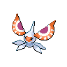

# Type Changes

| Pokemon                                                                                           | Old Type                                                              | New Type                                                                      |
| ------------------------------------------------------------------------------------------------- | --------------------------------------------------------------------- | ----------------------------------------------------------------------------- |
|  [Venomoth](/blaze-black-volt-white-two-wiki/pokemon/049)     |           |                 |
|  [Golduck](/blaze-black-volt-white-two-wiki/pokemon/055)       |                                      |             |
|  [Farfetchd](/blaze-black-volt-white-two-wiki/pokemon/083)   |     |         |
|  [Noctowl](/blaze-black-volt-white-two-wiki/pokemon/164)       |     |           |
|  [Masquerain](/blaze-black-volt-white-two-wiki/pokemon/284) |           |                     |
|  [Volbeat](/blaze-black-volt-white-two-wiki/pokemon/313)       |                                          |               |
|  [Illumise](/blaze-black-volt-white-two-wiki/pokemon/314)     |                                          |               |
|  [Glalie](/blaze-black-volt-white-two-wiki/pokemon/362)         |                                          |                       |
|  [Electivire](/blaze-black-volt-white-two-wiki/pokemon/466) |                                |     |
|  [Serperior](/blaze-black-volt-white-two-wiki/pokemon/497)   |                                      |               |
|  [Dewott](/blaze-black-volt-white-two-wiki/pokemon/502)         |                                      |           |
|  [Samurott](/blaze-black-volt-white-two-wiki/pokemon/503)     |                                      |           |
|  [Cofagrigus](/blaze-black-volt-white-two-wiki/pokemon/563) |                                      |                 |
|  [Gothita](/blaze-black-volt-white-two-wiki/pokemon/574)       |                                  |               |
|  [Gothitelle](/blaze-black-volt-white-two-wiki/pokemon/576) |                                  |               |
|  [Beartic](/blaze-black-volt-white-two-wiki/pokemon/614)       |                                          |               |